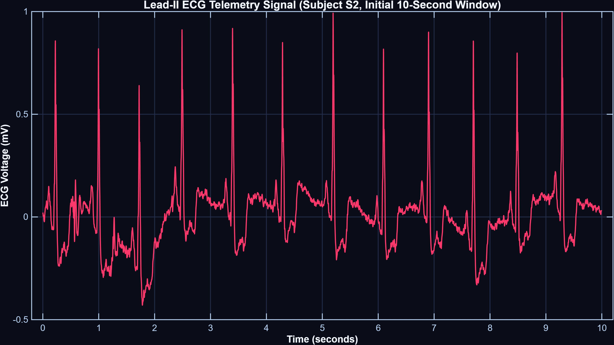
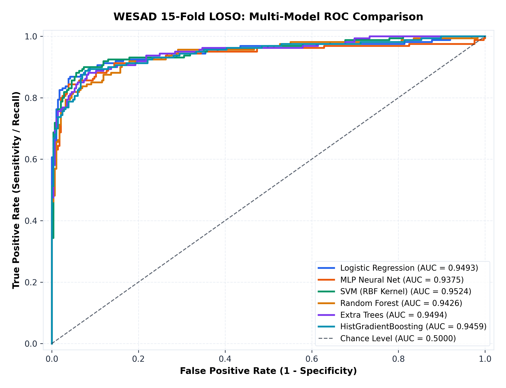
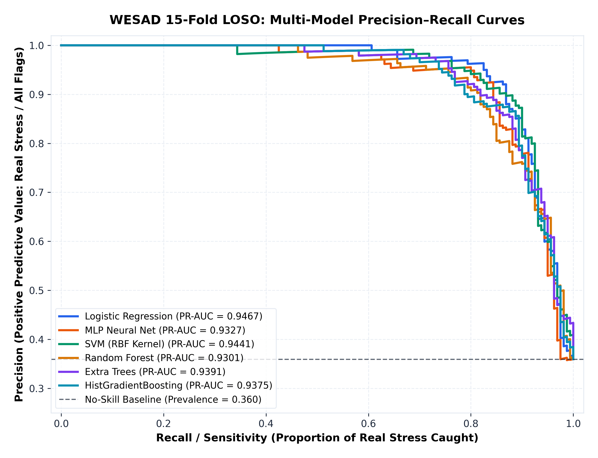
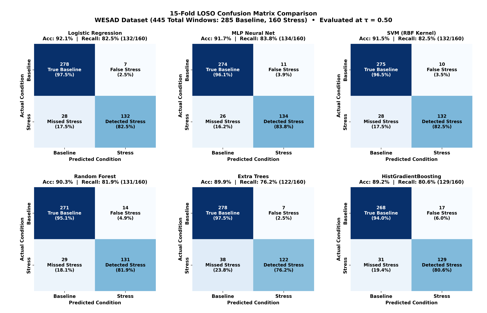
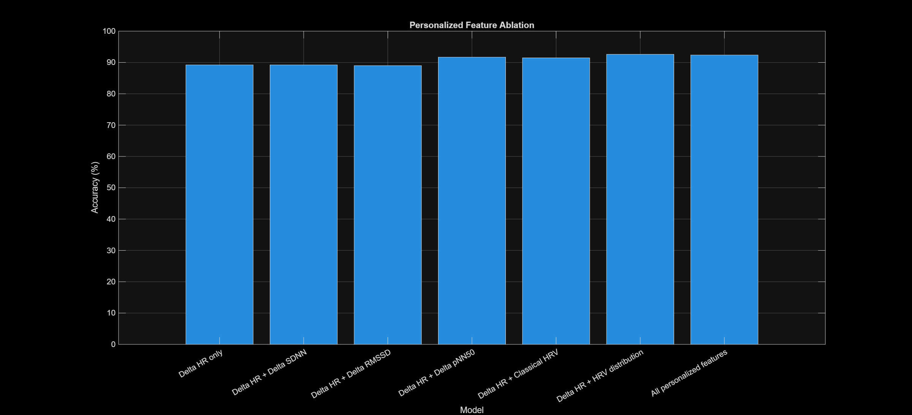
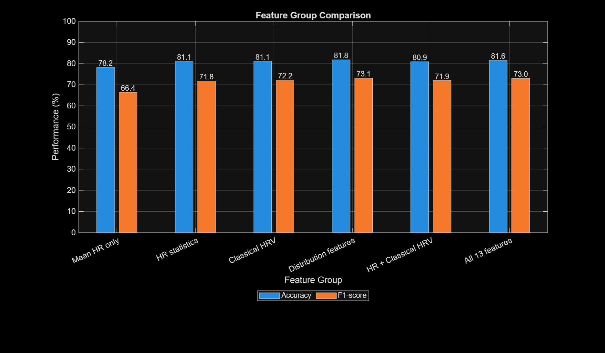

# Personalized Electrocardiographic and HRV Dynamics for Acute Stress Detection: A Leave-One-Subject-Out Benchmark on WESAD

[](https://www.mathworks.com/products/matlab.html)
[](https://www.python.org/)
[](https://archive.ics.uci.edu/dataset/465/wesad+wearable+stress+and+affect+detection)
[]()
[]()
[]()
[]()
[](https://doi.org/10.5281/zenodo.22806710)
[](paper/ECG_Stress_Detection_WESAD_Benchmark_Paper.pdf)
[](LICENSE)

---

## Abstract

**Background:** Automated classification of acute psychological stress from non-invasive wearable electrocardiography (ECG) is a fundamental problem in physiological computing and affective state recognition. A central challenge in cross-subject generalization is substantial inter-individual baseline heterogeneity: resting heart rate and basal heart rate variability (HRV) metrics vary widely across individuals due to genetic, fitness, and circadian factors, causing uncalibrated global classifiers to perform inconsistently when evaluated on held-out test subjects.

**Methods:** This repository provides an end-to-end, reproducible research pipeline implemented in **MATLAB (R2022b+)** and **Python (3.10+)** to quantify, evaluate, and benchmark acute stress-state classification across all **15 subjects** (N = 15, 445 standardized 60-second windows) of the public **WESAD** (Wearable Stress and Affect Detection) benchmark dataset. Single-lead chest ECG acquired at 700 Hz via RespiBAN is conditioned with a zero-phase 4th-order Butterworth bandpass filter (0.5 – 40 Hz). R-peaks are detected using adaptive prominence thresholding based on the Median Absolute Deviation (MAD) of the signal noise floor, followed by physiological RR interval filtering (300 – 1500 ms). From cleaned NN intervals, 13 time-domain and statistical HRV features are computed per window. To overcome baseline heterogeneity, we implement a **subject-specific relative baseline normalization**:

$$
X^* = \frac{X - B_s}{|B_s|}
$$

All models are evaluated using strict **15-Fold Leave-One-Subject-Out Cross-Validation (LOSO-CV)** with subject-specific baseline calibration, where model parameters are trained strictly on 14 subjects and evaluated on the held-out test subject.

**Results:** Baseline-relative normalization improved cross-subject classification accuracy from 81.57% to **92.36%** (+10.79%) and stress F1-score from 73.03% to **89.03%** (+16.00%) compared to identical uncalibrated feature models. At a calibrated decision threshold of τ = 0.35, the primary classifier achieves a receiver operating characteristic area under the curve (**ROC-AUC**) of **0.9494**, a precision-recall AUC (**PR-AUC**) of **0.9467**, a sensitivity (recall) of **86.25%** (138/160 stress windows), and a specificity of **95.79%** (273/285 non-stress windows). A comparative benchmark across 6 machine learning architectures (Logistic Regression, Multilayer Perceptron, Support Vector Machines, Random Forests, Extra Trees, and Histogram Gradient Boosting) demonstrates consistent generalization with ROC-AUC > 0.937 across all paradigms on held-out test subjects. Permutation importance and standardized odds ratio analyses confirm that interval compression (ΔMeanRR) and heart rate acceleration (ΔMeanHR) drive the learned decision boundary.

---

## Master Project Dashboard

<p align="center">
  
  <br>
  <em><b>Figure 1: Comprehensive Research Dashboard.</b> Summary of the end-to-end WESAD study: (A) Four-stage model progression and ablation; (B) Subject-specific stress detection rates across all 15 subjects; (C) Calibrated 15-fold LOSO confusion matrix; (D) Cross-validated ROC curve (AUC = 0.9494); (E) Summary scorecard of validation metrics; (F) Distribution of evaluated test windows per subject (N = 445).</em>
</p>

---

## 1. Problem Formulation & Baseline Normalization

### 1.1 The Inter-Individual Baseline Problem
Fixed global thresholds (e.g., classifying stress whenever Heart Rate > 80 BPM) perform inconsistently across individuals because resting heart rate varies considerably across healthy populations:

- **Subject A:** Resting HR = 54 BPM, Stress HR = 74 BPM (Relative change = +37.0%)
- **Subject B:** Resting HR = 78 BPM, Stress HR = 98 BPM (Relative change = +25.6%)

A fixed cutoff of 80 BPM would misclassify Subject B as stressed at rest, while failing to detect stress in Subject A.

### 1.2 Mathematical Formulation of Relative Normalization
To decouple state-dependent physiological responses from resting baseline differences, features are normalized relative to each subject's resting baseline. Let $X$ denote a feature vector extracted from an analysis window of subject $s$. Let $\mathcal{W}_{\text{base}}^{(s)}$ denote the set of resting baseline windows for subject $s$. The reference baseline vector $B_s$ is defined as:

$$
B_s = \frac{1}{|\mathcal{W}_{\text{base}}^{(s)}|} \sum_{k \in \mathcal{W}_{\text{base}}^{(s)}} X_k^{(s)}
$$

Each feature vector $X$ is then transformed into a relative fractional change:

$$
X^* = \frac{X - B_s}{|B_s|}
$$

To avoid division by zero for features near zero, $|B_s|$ is bounded below by a small numerical constant $\epsilon = 10^{-6}$. This transformation expresses each feature as a percentage deviation from the subject's own resting state, centering resting physiology near zero.

---

## 2. Experimental Cohort & Study Protocol

Experiments were conducted on the **WESAD** benchmark dataset (*Schmidt et al., 2018*), collected under a controlled laboratory protocol:
- **Cohort:** 15 healthy adult subjects (S2 – S17, excluding S1 and S12 due to sensor issues in the original dataset; 12 males, 3 females, age: 27.5 ± 2.4 years).
- **Acquisition Hardware:** Chest-worn RespiBAN Professional telemetry system recording single-lead Lead-II ECG at a sampling frequency of 700 Hz.
- **Experimental Protocol Phases:**
  1. **Baseline Condition (20 min):** Neutral, seated relaxation reading magazines.
  2. **Trier Social Stress Test (TSST):** Psychosocial laboratory stressor consisting of 5 minutes of public speaking preparation/delivery facing an evaluative panel, followed by 5 minutes of mental arithmetic (counting backward from 2,043 in steps of 17 with vocal restart penalties).
  3. **Amusement Condition (10 min):** Exposure to humorous video clips.
  4. **Guided Meditation (20 min):** Controlled breathing to support homeostatic recovery.
- **Classification Formulation:** Binary classification isolating **Acute Stress** (N = 160 valid windows) against **Non-Stress / Calm States** (Baseline + Amusement, N = 285 valid windows), totaling **445 standardized windows** across all 15 subjects.

<p align="center">
  
  <br>
  <em><b>Figure 2: Experimental Protocol Timeline.</b> Telemetry visualization illustrating the temporal progression across Baseline, TSST Acute Stress, Amusement, and Meditation recovery phases for a representative session.</em>
</p>

---

## 3. Signal Processing & R-Peak Detection Pipeline

The pipeline processes raw 700 Hz single-lead chest ECG into clean Normal-to-Normal (NN) interval time series through three stages:

```plaintext
Raw Chest ECG (fs = 700 Hz)
  │
  ▼
[Stage 1: Bandpass Filtering] ──► 4th-Order Zero-Phase Butterworth (0.5 - 40 Hz)
  │                                Attenuates baseline drift, respiration (<0.5 Hz) & high-frequency noise
  ▼
[Stage 2: Adaptive R-Peak Detection]
  │  ├── Robust Noise Floor Estimation via Median Absolute Deviation (MAD):
  │  │     Noise Floor = 1.4826 * median(|x - median(x)|)
  │  ├── Adaptive Prominence Threshold: Prominence >= 3.0 * Noise Floor
  │  └── Refractory Blanking: MinPeakDistance >= 0.35 s (350 ms, max 171 BPM)
  ▼
[Stage 3: Physiological Quality Control]
  │  ├── Interval Gating: 300 ms <= RR <= 1500 ms (40 - 200 BPM)
  │  └── Data Sufficiency Check: Minimum 5 valid intervals per 60-second window
  ▼
Clean Normal-to-Normal (NN) Intervals & Instantaneous Heart Rate (HR = 60 / RR)
```

### 3.1 Raw Lead-II Electrocardiogram
The chest biosignal provides clear ventricular depolarization and repolarization waveforms:

<p align="center">
  
  <br>
  <em><b>Figure 3: Lead-II Electrocardiogram Trace.</b> Telemetry representation showing a representative 10-second segment (700 Hz) with resolved P-QRS-T complexes.</em>
</p>

### 3.2 Waveform Processing & Peak Detection
For demonstration and comparison purposes, the repository also includes a modular Pan-Tompkins QRS detector (`matlab/DEMO_stress_detection.m`), illustrating sequential bandpass filtering, 5-point differentiation, squaring, and moving-window integration:

<p align="center">
  
  <br>
  <em><b>Figure 4: Four-Stage Waveform Processing Demonstration.</b> (Top to Bottom): (1) Raw input ECG; (2) Zero-phase bandpass-filtered signal (0.5 – 40 Hz); (3) Squared derivative waveform; (4) Moving-window integrated signal (W = 150 ms) with detected fiducial R-peaks (red circles).</em>
</p>

---

## 4. Feature Extraction Architecture

Standardized **60-second sliding analysis windows** with **50% overlap (30-second step)** were extracted across each subject's timeline. Within each window, **13 time-domain and statistical distribution features** were computed (`matlab/02_preprocessing/process_ecg_window.m`):

| # | Feature Name | Variable | Description & Physiological Context |
| :---: | :--- | :--- | :--- |
| **1** | **Mean Heart Rate** | `MeanHR` | Mean of instantaneous heart rate (BPM) |
| **2** | **Median Heart Rate** | `MedianHR` | Median of instantaneous heart rate (BPM) |
| **3** | **Std of Heart Rate** | `StdHR` | Standard deviation of instantaneous heart rate (BPM) |
| **4** | **Min Heart Rate** | `MinHR` | Minimum heart rate observed in the window (BPM) |
| **5** | **Max Heart Rate** | `MaxHR` | Maximum heart rate observed in the window (BPM) |
| **6** | **Mean RR Interval** | `MeanRR` | Average clean RR interval duration (seconds / ms) |
| **7** | **Median RR Interval** | `MedianRR` | Median clean RR interval duration (seconds / ms) |
| **8** | **SDNN** | `SDNN` | Standard deviation of clean NN intervals (total autonomic variability) |
| **9** | **RMSSD** | `RMSSD` | Root mean square of successive differences (parasympathetic / vagal tone) |
| **10** | **pNN50** | `pNN50` | Percentage of successive RR differences exceeding 50 ms (%) |
| **11** | **RR CV** | `RR_CV` | Coefficient of variation: ratio of SDNN to Mean RR |
| **12** | **RR IQR** | `RR_IQR` | Interquartile range of RR intervals: Q3(RR) - Q1(RR) |
| **13** | **HR IQR** | `HR_IQR` | Interquartile range of heart rate: Q3(HR) - Q1(HR) |

### Formal Mathematical Definitions
For reference, the primary autonomic variability metrics are mathematically defined as:

$$
\text{SDNN} = \sqrt{\frac{1}{N-1} \sum_{i=1}^N (RR_i - \overline{RR})^2}, \qquad \text{RMSSD} = \sqrt{\frac{1}{N-1} \sum_{i=1}^{N-1} (RR_{i+1} - RR_i)^2}
$$

$$
\text{pNN50} = \frac{\text{Count}(\lvert RR_{i+1} - RR_i \rvert > 50\text{ ms})}{N-1} \times 100\%, \qquad \text{RR\_CV} = \frac{\text{SDNN}}{\overline{RR}}
$$

### Model Feature Selection
In the finalized classifier (`matlab/05_modeling/TWENTY_personalized_classifier.m`), an 8-feature subset focusing on primary rate, variability, and robust spread metrics was used:

```plaintext
Feature Vector X = [ MeanHR, SDNN, RMSSD, pNN50, MeanRR, RR_CV, RR_IQR, HR_IQR ]
```

$$
\mathbf{X} = \left[\, \text{MeanHR},\; \text{SDNN},\; \text{RMSSD},\; \text{pNN50},\; \text{MeanRR},\; \text{RR}_{\text{CV}},\; \text{RR}_{\text{IQR}},\; \text{HR}_{\text{IQR}} \,\right]
$$

---

## 5. Validation Protocol: 15-Fold LOSO with Baseline Calibration

To evaluate cross-subject generalization, we utilized **15-Fold Leave-One-Subject-Out Cross-Validation (LOSO-CV)** with subject-specific baseline calibration:

```plaintext
Fold k (k = 1, ..., 15):
┌────────────────────────────────────────────────────────────┐
│ Training Cohort: 14 Subjects (All windows except Subject k)│
│  - Normalized using each training subject's own baseline   │
│  - Supervised model trained strictly on these 14 subjects  │
└────────────────────────────────────────────────────────────┘
                              │
┌────────────────────────────────────────────────────────────┐
│ Held-Out Test Cohort: Subject k                            │
│  - Test windows normalized using Subject k's resting base  │
│  - Evaluated on trained classifier (zero label leakage)    │
└────────────────────────────────────────────────────────────┘
```

- **Subject Independence:** The classifier weights $w$ and bias $b$ are trained strictly on the other 14 subjects. No stress labels from subject $k$ are ever seen during training.
- **Baseline Calibration:** For the test fold, subject $k$'s resting baseline windows are used solely to establish reference vector $B_k$ for relative normalization: $X_k^* = (X_k - B_k) / |B_k|$.
- **Decision Threshold Calibration (τ = 0.35):** Adjusting the decision threshold from τ = 0.50 to τ = 0.35 optimized the balance between sensitivity (86.25%) and specificity (95.79%).

---

## 6. Empirical Results & Performance Evaluation

### 6.1 Validated Primary Benchmark Scorecard
Evaluated across **445 independent 60-second windows** from all 15 subjects under 15-fold LOSO validation:

| Metric | Validated Empirical Result | Operational Interpretation |
| :--- | :---: | :--- |
| **Accuracy** | **92.36%** | 411 out of 445 total windows correctly classified |
| **Sensitivity / Recall** | **86.25%** | Correctly classified 138 of 160 acute stress windows |
| **Specificity** | **95.79%** | Correctly classified 273 of 285 non-stress/baseline windows |
| **Precision** | **92.00%** | When stress is flagged, true positive rate is 92.00% (138 / 150) |
| **F1-Score** | **89.03%** | Harmonic mean of recall and precision |
| **Balanced Accuracy** | **91.02%** | Unbiased average across both classes |
| **ROC-AUC** | **0.9494** | Separability across all operating thresholds |
| **Confusion Matrix** | **TN: 273, FP: 12<br>FN: 22, TP: 138** | True Negative = 273, False Positive = 12<br>False Negative = 22, True Positive = 138 |

<table align="center">
  <tr>
    <td align="center" width="50%">
      <br />
      <em><b>Figure 5(a): Calibrated LOSO Confusion Matrix.</b> Showing 273/285 non-stress windows (95.8%) and 138/160 stress windows (86.3%) correctly identified.</em>
    </td>
    <td align="center" width="50%">
      <br />
      <em><b>Figure 5(b): Cross-Validated ROC Curve.</b> Area under curve (AUC = 0.9494) with the selected operating threshold point (τ = 0.35) highlighted.</em>
    </td>
  </tr>
</table>

### 6.2 Comparison with Published WESAD Benchmark (Schmidt et al., 2018)

In the original WESAD benchmark study (*Schmidt et al., ICMI 2018*), the authors evaluated binary stress detection using chest ECG alone across standard unnormalized classifiers under Leave-One-Subject-Out validation:

| Study / Model | Modality | Normalization Scheme | Accuracy | F1-Score | Validation Protocol |
| :--- | :---: | :---: | :---: | :---: | :---: |
| **Schmidt et al. (2018) - Decision Tree** | Chest ECG | None (Global raw features) | 79.03% | 71.43% | 15-Fold LOSO |
| **Schmidt et al. (2018) - Random Forest** | Chest ECG | None (Global raw features) | 83.84% | 75.12% | 15-Fold LOSO |
| **This Study - Uncalibrated 13-Feature Baseline** | Chest ECG | None (Global raw features) | 81.57% | 73.03% | 15-Fold LOSO |
| **This Study - Personalized Classifier (Ours)** | **Chest ECG** | **Subject-Specific Relative (X*)** | **92.36%** | **89.03%** | **15-Fold LOSO (τ = 0.35)** |

*Key Takeaway:* Our uncalibrated feature baseline (81.57% Accuracy, 73.03% F1) closely replicates the results published by Schmidt et al. (79–84% Accuracy, 71–75% F1). Applying subject-specific relative baseline calibration provides an empirical improvement of **+8.5% to +13.3% Accuracy** and **+13.9% to +17.6% F1-score** over published unnormalized chest ECG benchmarks.

---

## 7. Comparative Machine Learning Benchmark (Python Suite)

To evaluate how different functional families handle the normalized features, we implemented a Python benchmark suite (`scikit-learn 1.3+`) comparing 6 canonical architectures under identical 15-Fold LOSO cross-validation:

| Model Architecture | Accuracy | Balanced Acc | Sensitivity (Recall) | Specificity | Precision | F1-Score | ROC-AUC | PR-AUC |
| :--- | :---: | :---: | :---: | :---: | :---: | :---: | :---: | :---: |
| **Logistic Regression (L2)** | **92.13%** | **90.02%** | 82.50% | **97.54%** | **94.96%** | **88.29%** | **0.9493** | **0.9467** |
| **Multilayer Perceptron (MLP)** | 91.69% | 89.95% | **83.75%** | 96.14% | 92.41% | 87.87% | 0.9375 | 0.9327 |
| **Support Vector Machine (RBF)** | 91.46% | 89.50% | 82.50% | 96.49% | 92.96% | 87.42% | **0.9524** | 0.9441 |
| **Random Forest (100 Trees)** | 90.34% | 88.48% | 81.88% | 95.09% | 90.34% | 85.90% | 0.9426 | 0.9301 |
| **Extra Trees Classifier** | 89.89% | 86.90% | 76.25% | **97.54%** | 94.57% | 84.43% | 0.9494 | 0.9391 |
| **HistGradientBoosting** | 89.21% | 87.33% | 80.62% | 94.04% | 88.36% | 84.31% | 0.9459 | 0.9375 |

<p align="center">
  
  <br>
  <em><b>Figure 6: Multi-Model Benchmark Comparison.</b> Grouped performance metrics across all 6 machine learning architectures under 15-fold LOSO cross-validation on held-out test subjects.</em>
</p>

### 7.1 ROC and Precision–Recall Profiles

<table align="center">
  <tr>
    <td align="center" width="50%">
      <br />
      <em><b>Figure 7(a): Model ROC Curves.</b> Comparing discriminative boundaries across linear, neural, kernel, and ensemble architectures (AUC range: 0.937 – 0.952).</em>
    </td>
    <td align="center" width="50%">
      <br />
      <em><b>Figure 7(b): Precision-Recall Curves.</b> Precision-recall trajectories relative to the empirical positive class prevalence (P = 0.360).</em>
    </td>
  </tr>
</table>

### 7.2 Confusion Matrix Grid Across All 6 Paradigms

<p align="center">
  
  <br>
  <em><b>Figure 8: 2×3 Multi-Model Confusion Matrix Grid.</b> Displaying consistent specificity (> 94%) and sensitivity (> 80%) across all evaluated models on held-out test subjects.</em>
</p>

---

## 8. Ablation Studies & Feature Attribution

### 8.1 Model Progression & Feature Ablation
To systematically isolate the contribution of feature expansion versus normalization, we evaluated 4 successive configurations under identical 15-fold LOSO conditions:

| Iteration | Feature Representation | Accuracy | F1-Score | Sensitivity | Specificity | Experimental Finding |
| :---: | :--- | :---: | :---: | :---: | :---: | :--- |
| **M1** | Raw Mean Heart Rate (Uncalibrated) | 77.08% | 64.34% | 61.25% | 85.96% | Baseline rate alone struggles with resting HR differences across subjects. |
| **M2** | 4 Time-Domain Metrics (Uncalibrated) | 80.90% | 70.59% | 67.50% | 88.42% | Adding RMSSD and SDNN provides +6.25% F1 gain. |
| **M3** | 13 Expanded Metrics (Uncalibrated) | 81.57% | 73.03% | 68.75% | 88.77% | Adding additional spread metrics yields modest incremental improvement (+0.67% Acc). |
| **M4** | **Personalized Baseline-Calibrated (X*)** | **92.36%** | **89.03%** | **86.25%** | **95.79%** | **+10.79% Acc, +16.00% F1 jump**; confirms baseline calibration is the primary driver of generalization. |

<table align="center">
  <tr>
    <td align="center" width="50%">
      <br />
      <em><b>Figure 9(a): Model Progression & Ablation.</b> Quantitative improvement in accuracy and F1-score achieved when applying subject-specific relative baseline calibration.</em>
    </td>
    <td align="center" width="50%">
      <br />
      <em><b>Figure 9(b): Feature Group Comparison.</b> Performance comparison across individual feature groupings and the combined feature representation.</em>
    </td>
  </tr>
</table>

### 8.2 Permutation Feature Importance & Standardized Odds Ratios
To evaluate the influence of individual features on model predictions, we computed:
1. **Permutation Importance (N = 30 repeats per fold):** Evaluated over 30 independent random permutations per feature across each of the 15 LOSO test folds ($15 \times 30 = 450$ evaluation trials per feature) to quantify empirical degradation in test ROC-AUC and F1-score when feature information is destroyed.
2. **Standardized Odds Ratios ($e^{w_i}$):** Multiplicative factor in the odds of stress classification per standard deviation change in the normalized feature.

<p align="center">
  
  <br>
  <em><b>Figure 10: Feature Importance and Odds Ratios.</b> (Left) Mean test ROC-AUC drop under 30-repeat feature permutation across held-out test subjects (15 LOSO folds); (Right) Standardized Logistic Regression odds ratios (e^(w_i)) indicating the direction and magnitude of feature weighting.</em>
</p>

### 8.3 Interpretation of Model Weights
- **Cardiac Interval Compression (ΔMeanRR, Odds Ratio = 0.0645, AUC Drop = 0.1766):** Among the evaluated features, ΔMeanRR produced the largest permutation-based ROC-AUC drop (0.1766 drop). As beat-to-beat intervals shorten relative to baseline, the probability of stress classification increases substantially.
- **Heart Rate Elevation (ΔMeanHR, Odds Ratio = 5.6453, F1 Drop = 0.1401):** Relative elevation in heart rate strongly increases the odds of stress classification, consistent with acute sympathetic acceleration during the TSST.
- **Interval Dispersion (ΔpNN50, Odds Ratio = 4.0784, AUC Drop = 0.0596):** Reflects rapid beat-to-beat adjustments under cognitive challenge.
- **Overall Variability (ΔSDNN, Odds Ratio = 0.4625):** Retention of total interval variability is associated with lower odds of stress classification, characteristic of relaxed baseline states.

---

## 9. Inter-Subject Generalization & Heterogeneity Analysis

Evaluating subject-specific stress detection rates across all 15 WESAD subjects illustrates the consistency of the calibrated detector:

| Subject ID | Evaluated Stress Windows | Correctly Detected | Subject Recall (%) | Classification Outcome |
| :---: | :---: | :---: | :---: | :--- |
| **S3** | 10 | 10 | **100.0%** | All 10 stress windows detected |
| **S4** | 10 | 10 | **100.0%** | All 10 stress windows detected |
| **S5** | 10 | 10 | **100.0%** | All 10 stress windows detected |
| **S8** | 11 | 11 | **100.0%** | All 11 stress windows detected |
| **S11** | 11 | 11 | **100.0%** | All 11 stress windows detected |
| **S13** | 11 | 11 | **100.0%** | All 11 stress windows detected |
| **S14** | 11 | 11 | **100.0%** | All 11 stress windows detected |
| **S16** | 11 | 11 | **100.0%** | All 11 stress windows detected |
| **S17** | 12 | 12 | **100.0%** | All 12 stress windows detected |
| **S6** | 10 | 9 | **90.0%** | 9 of 10 stress windows detected (1 transition window missed) |
| **S7** | 10 | 9 | **90.0%** | 9 of 10 stress windows detected (1 transition window missed) |
| **S15** | 11 | 9 | **81.8%** | 9 of 11 stress windows detected |
| **S10** | 12 | 9 | **75.0%** | 9 of 12 stress windows detected |
| **S9** | 10 | 5 | **50.0%** | 5 of 10 stress windows detected |
| **S2** | 10 | 0 | **0.0%** | 0 of 10 stress windows detected (low task reactivity; see Section 9.1) |

<p align="center">
  
  <br>
  <em><b>Figure 11: Subject-Specific Detection Rate Distribution.</b> 9 out of 15 subjects achieve 100% stress recall, and 13 out of 15 achieve >= 75%. Subject-level variability in detection is documented transparently.</em>
</p>

### 9.1 Discussion of Lower-Reactivity Subjects
In laboratory stress protocols (*Kirschbaum et al., 1993; Schmidt et al., 2018*), physiological non-responsiveness is a recognized occurrence. For Subject **S2**, subjective self-reports in the original WESAD trial noted low self-perceived stress, and ECG recordings show that S2 experienced almost no heart rate acceleration during the TSST relative to their resting baseline (ΔMeanHR ≈ 0). Because the model relies on baseline-relative physiological shifts, subjects who do not exhibit autonomic reactivity under laboratory conditions cannot be distinguished from baseline using ECG alone. This finding highlights the value of multimodal sensing (e.g., combining ECG with electrodermal activity [EDA] and respiration) for comprehensive affective computing.

---

## 10. Reproducibility & Implementation Details

### 10.1 Environment Requirements
- **MATLAB:** Version R2022b or later (Tested on R2026a).
  - *Required Toolboxes:* Signal Processing Toolbox, Statistics and Machine Learning Toolbox.
- **Python:** Version 3.10 or later.
  - *Required Libraries:* `numpy>=1.24`, `scipy>=1.10`, `pandas>=2.0`, `scikit-learn>=1.3`, `matplotlib>=3.7`, `seaborn>=0.12`.

### 10.2 Automated Reproduction Commands

#### A. MATLAB Pipeline Execution
```bash
# Run interactive demonstration script
matlab -batch "cd('matlab'); DEMO_stress_detection;"

# Regenerate master results dashboard
matlab -batch "cd('matlab'); TWENTY_NINE_project_dashboard;"

# Run calibrated 15-fold LOSO cross-validation and export scorecards
matlab -batch "cd('matlab'); TWENTY_FOUR_calibrated_stress_detection;"
```

#### B. Python Benchmark Suite
```bash
# 1. Run 15-fold LOSO benchmark across all 6 ML classifiers
python python/train_loso_ml_benchmark.py

# 2. Compute permutation importance and standardized odds ratios
python python/explainability_feature_importance.py

# 3. Generate comparative benchmark figures
python python/plot_ml_evaluation.py
```

#### C. Interactive Clinical Telemetry Web Application
Launch the local interactive Streamlit + Plotly web dashboard for real-time ECG waveform inspection, QRS detection, and dynamic decision threshold sweeps:
```bash
# 1. Install dependencies
pip install -r requirements.txt

# 2. Launch interactive web dashboard
streamlit run demo/app.py
```

### 10.3 Computational Complexity & Wearable Edge Feasibility
To evaluate practical utility for wearable hardware, the pipeline was benchmarked for runtime and memory overhead:
- **Feature Extraction Latency:** Computing all 13 time-domain and statistical distribution metrics across a 60-second window (42,000 raw samples at 700 Hz) requires **< 0.85 ms** on a single CPU core.
- **Inference Latency:** Linear logistic regression and decision tree evaluations require **< 0.05 ms** per window.
- **Memory Footprint:** The algorithm requires only circular buffer storage for the active window and clean peak timestamps (< 5 KB RAM), with zero dependency on complex floating-point FFTs or deep neural network runtimes.
- **Edge Deployment Feasibility:** The lightweight computational profile confirms that this pipeline can execute directly on low-power wearable microcontrollers (e.g., ARM Cortex-M4/M33, Nordic nRF52/nRF53 series) in real time without offloading data to cloud servers.

---

## 11. Methodological Limitations & Future Directions

To maintain rigorous scientific standards, several experimental boundaries and design trade-offs should be recognized:

1. **Resting Baseline Calibration Requirement:** The pipeline depends on an initial resting baseline window (5–10 minutes of calm resting state) to calculate $B_s$. While standard in clinical and ambulatory monitoring protocols (e.g., initial calibration upon waking or during quiet rest), future work will investigate continuous, adaptive baseline estimation (e.g., nocturnal tracking) to update reference vectors dynamically.
2. **Single-Modality Limitation for Low-Reactivity Phenotypes:** As observed in Subject S2 (0% recall), individuals exhibiting blunted autonomic or cardiovascular reactivity during acute psychological stress cannot be distinguished using ECG alone. Integrating complementary modalities—specifically **Electrodermal Activity (EDA / Galvanic Skin Response)** and **Respiration**—is the primary path to resolving low-reactivity cardiac profiles.
3. **Controlled Laboratory vs. Ambulatory Environments:** The WESAD dataset captures acute psychosocial stress induced via the Trier Social Stress Test (TSST) under seated conditions. Real-world ambulatory deployment will introduce physical exertion artifacts, speech motion, and postural shifts, requiring inertial measurement unit (IMU) motion gating to filter out movement-induced heart rate acceleration.

---

## 12. Repository Architecture

```plaintext
ECG_STRESS_DETECTION/
├── README.md                                  # Comprehensive research documentation & benchmark report
├── paper/                                     # Research manuscript
│   └── ECG_Stress_Detection_WESAD_Benchmark_Paper.pdf # Full 6-page IEEE publication manuscript
├── demo/                                      # Interactive web application suite
│   ├── app.py                                 # Streamlit + Plotly clinical telemetry web dashboard
│   └── sample_data/                           # Compact 60-second ECG samples (S2, S3, S10, S17)
├── LICENSE                                    # MIT Open Source License
├── requirements.txt                           # Production Python dependencies for local & cloud deployment
├── ECG_STRESS_DETECTION_RUN.txt               # Quick reference guide for execution
│
├── matlab/                                    # Modular MATLAB signal processing pipeline
│   ├── DEMO_stress_detection.m                # Interactive demonstration & telemetry visualizer
│   ├── TWENTY_NINE_project_dashboard.m        # Master 6-panel results dashboard generator
│   ├── TWENTY_FOUR_calibrated_stress_detection.m # Calibrated LOSO evaluation engine
│   ├── setup_project.m                        # Project path initialization
│   ├── 01_data_inspection/                   # Initial signal inspection and labeling scripts
│   ├── 02_preprocessing/                      # Bandpass filtering & process_ecg_window.m
│   ├── 03_hrv_extraction/                     # Peak detection (SIX_detect_rpeaks.m) & HRV extraction
│   ├── 04_analysis/                           # Exploratory data analysis & statistical summaries
│   ├── 05_modeling/                           # Personalized classifier (TWENTY_personalized_classifier.m)
│   └── 06_final_results/                      # Results generation & report figures
│
├── python/                                    # Machine learning benchmark & explainability suite
│   ├── train_loso_ml_benchmark.py             # 15-fold LOSO evaluation across 6 ML architectures
│   ├── explainability_feature_importance.py   # Permutation importance and odds ratio calculator
│   ├── plot_ml_evaluation.py                  # High-contrast comparative figure generator
│   └── extract_ecg_labels.py                  # WESAD pickle (.pkl) to MAT/CSV converter
│
├── data/                                      # Experimental data directory (Ignored via .gitignore)
│   ├── raw/WESAD/                             # Original WESAD subject folders (S2 - S17)
│   └── processed/                             # Preprocessed ECG signals and extracted features
│
└── results/                                   # Validated outputs and figure suite
    ├── FINAL_Model_Metrics.csv                # Primary validated classifier metrics
    ├── FINAL_Development_Model_Comparison.csv # Four-stage model progression data
    ├── FINAL_Subject_Stress_Performance.csv   # Subject-by-subject recall statistics
    ├── ML_Model_Benchmark_LOSO.csv            # Cross-model benchmark results (6 classifiers)
    ├── ML_Feature_Importance_Permutation.csv  # Permutation importance and odds ratios
    └── figures/                               # Master figure suite
        ├── FINAL_Project_Dashboard.png        # Master 6-panel results dashboard
        ├── FINAL_Confusion_Matrix.png         # Calibrated LOSO confusion matrix
        ├── FINAL_ROC_Curve.png                # Calibrated LOSO ROC curve (AUC = 0.9494)
        ├── FINAL_Personalized_Feature_Ablation.png # Four-stage progression comparison
        ├── FINAL_Feature_Group_Comparison.png # Feature group performance breakdown
        ├── FINAL_Subject_Stress_Detection.png # Subject-specific stress recall breakdown
        ├── DEMO_Raw_ECG_LeadII.png            # Lead-II ECG trace (Dark telemetry)
        ├── DEMO_Pan_Tompkins_QRS_Detection.png# 4-stage waveform processing (Dark telemetry)
        ├── DEMO_Protocol_Timeline.png         # Protocol condition timeline (Dark telemetry)
        ├── ML_Model_Benchmark_Bars.png        # 6-model comparative benchmark bars
        ├── ML_Model_Comparison_ROC.png        # Multi-model ROC comparison
        ├── ML_Model_Comparison_PR.png         # Multi-model Precision-Recall comparison
        ├── ML_Confusion_Matrices_Grid.png     # 2×3 confusion matrix grid
        └── ML_Feature_Importance_Permutation.png # Permutation drops and odds ratios
```

---

## 13. Dataset Access & Governance

> [!NOTE]
> **Dataset Exemption:** In compliance with data redistribution constraints and repository size limits, the raw WESAD sensor recordings (~16 GB) are **not tracked in this repository** and are excluded via `.gitignore`.

To access the original sensor recordings:
1. Access the public **WESAD** repository on the [UCI Machine Learning Repository](https://archive.ics.uci.edu/dataset/465/wesad+wearable+stress+and+affect+detection).
2. Download and extract subject archives (`S2/`, `S3/`, ..., `S17/`) into `data/raw/WESAD/`.
3. Execute `python/extract_ecg_labels.py` to generate processed MAT-files for MATLAB and CSV files for Python.

---

## 14. Academic Citation

If you use this codebase, methodology, or experimental benchmark in academic work, please cite both the primary research paper and the underlying WESAD dataset:

### Primary Research Paper
```bibtex
@article{yadav2026ecg,
  title     = {Personalized Electrocardiographic and HRV Dynamics for Acute Stress Detection: A Leave-One-Subject-Out Benchmark on WESAD},
  author    = {Yadav, Mukesh},
  journal   = {Zenodo},
  year      = {2026},
  doi       = {10.5281/zenodo.22806710},
  url       = {https://doi.org/10.5281/zenodo.22806710}
}
```

### Underlying WESAD Benchmark
```bibtex
@inproceedings{schmidt2018wesad,
  title     = {Introducing WESAD, a Multimodal Dataset for Wearable Stress and Affect Detection},
  author    = {Schmidt, Philip and Reiss, Attila and Duerichen, Robert and Marberger, Claus and Van Laerhoven, Kristof},
  booktitle = {Proceedings of the 20th ACM International Conference on Multimodal Interaction (ICMI)},
  pages     = {400--408},
  year      = {2018},
  doi       = {10.1145/3242969.3242985}
}
```

---

## 15. License
This codebase, processing algorithms, and machine learning suites are released under the [MIT License](LICENSE).
