# Personalized Electrocardiographic and HRV Dynamics for Acute Stress Detection: A Leave-One-Subject-Out Benchmark and Bare-Metal Edge IoMT Implementation

[](https://www.mathworks.com/products/matlab.html)
[](https://www.python.org/)
[-002B49.svg?style=flat-square&logo=stmicroelectronics)](https://www.st.com/en/microcontrollers-microprocessors/stm32g474re.html)
[-0091BD.svg?style=flat-square&logo=arm)](https://arm-software.github.io/CMSIS_5/DSP/html/index.html)
[](https://archive.ics.uci.edu/dataset/465/wesad+wearable+stress+and+affect+detection)
[]()
[]()
[]()
[]()
[]()
[](https://doi.org/10.5281/zenodo.22895173)
[](paper/Personalized_ECG_Stress_Detection_WESAD_Benchmark_and_STM32_Edge_IoMT.pdf)
[](LICENSE)

> 🌐 **Interactive Research Benchmark & ECG Telemetry:** [Mukesh Yadav | Biosignal Processing & Edge IoMT Portfolio](https://mukesh-yadav-res-portfolio.vercel.app/)

---

## Visual Project Showcase

<p align="center">
  
  <br>
  <em><b>Figure 1: Master Research Benchmark Dashboard.</b> End-to-end WESAD study: (A) Four-stage model progression & feature ablation; (B) Subject-specific stress detection rates across all 15 subjects; (C) Calibrated 15-fold LOSO confusion matrix (TN: 273, FP: 12, FN: 22, TP: 138); (D) Cross-validated ROC curve (AUC = 0.9494); (E) Validated performance scorecard; (F) Test window distribution across subjects (N = 445).</em>
</p>

<table align="center" width="100%">
  <tr>
    <td align="center" width="50%">
      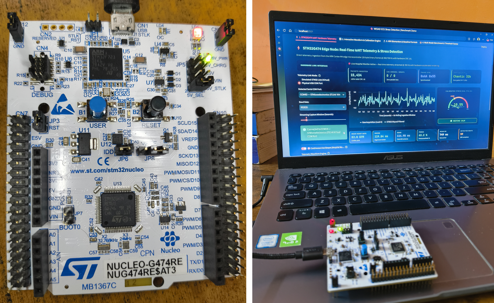<br />
      <em><b>Figure 2(a): Physical STM32 Edge Hardware Testbed.</b> NUCLEO-G474RE (170 MHz ARM Cortex-M4) testbed streaming real-time filtered and chaotic scrambled ECG over physical USB-UART (COM10 @ 115,200 baud).</em>
    </td>
    <td align="center" width="50%">
      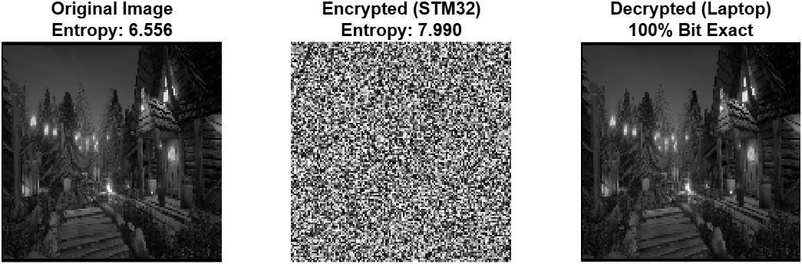<br />
      <em><b>Figure 2(b): Chaotic Stream Diffusion Verification.</b> Empirical validation of the on-chip 32-bit discrete chaotic generator, demonstrating near-ideal Shannon entropy elevation (H = 7.990 bits/byte, 99.88% of theoretical limit) with bit-exact (0.000000 V) terminal reconstruction.</em>
    </td>
  </tr>
</table>

<table align="center" width="100%">
  <tr>
    <td align="center" width="50%">
      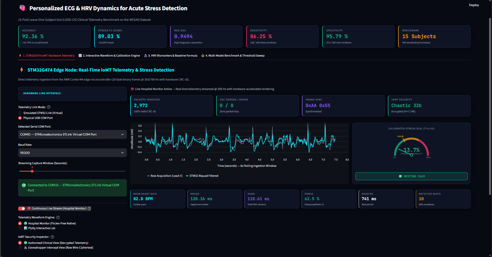<br />
      <em><b>Figure 3(a): Authorized Monitoring Terminal View.</b> Live physical STM32 telemetry (COM10 @ 115,200 baud, 350 Hz): real-time descrambled Lead-II ECG, dynamic QRS tracking, live HRV cards, and calibrated acute stress inference (τ = 0.35).</em>
    </td>
    <td align="center" width="50%">
      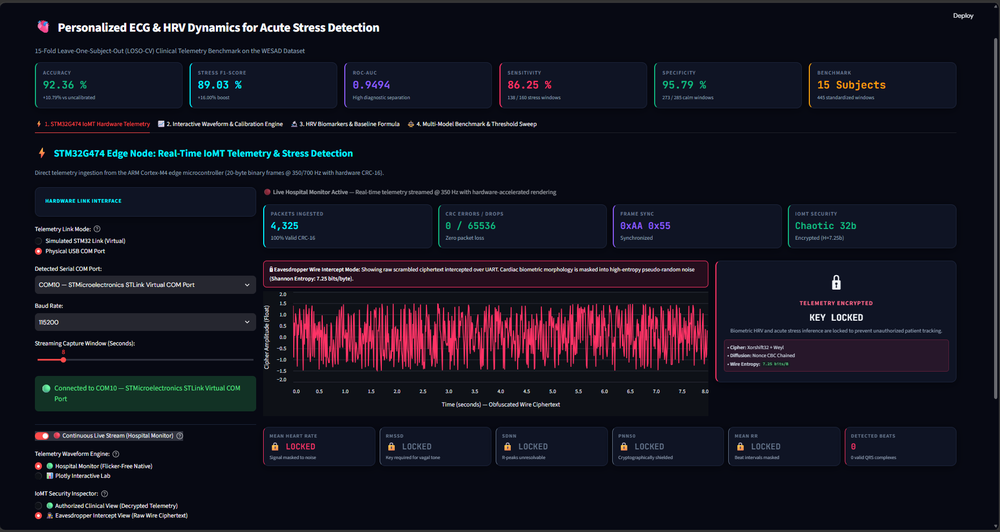<br />
      <em><b>Figure 3(b): Adversarial Wire Intercept View.</b> Physical UART eavesdropping without decryption keys: raw scrambled high-entropy ciphertext (H = 7.25 bits/byte), zero resolvable QRS fiducials, and locked biometric cards.</em>
    </td>
  </tr>
</table>

---

## Executive Summary & Abstract

Automated classification of acute psychological stress from non-invasive wearable electrocardiography (ECG) is a fundamental problem in physiological computing, affective state recognition, and wearable Internet of Medical Things (IoMT). A central barrier to cross-subject generalization is **inter-individual baseline heterogeneity**: resting heart rate and basal heart rate variability (HRV) metrics vary widely across individuals due to genetic, cardiorespiratory fitness, and circadian factors, causing uncalibrated global classifiers to degrade substantially on unseen subjects.

In this work, we present an end-to-end reproducible research pipeline benchmarked across all **15 subjects** (N = 15, 445 standardized 60-second windows) of the public **WESAD** (Wearable Stress and Affect Detection) dataset, paired with a bare-metal embedded microcontroller deployment on the **ARM Cortex-M4 (STM32G474RE)**:

1. **Relative Baseline Calibration:** Transforming features into fractional deviations relative to each subject's resting baseline (X* = (X - B_s) / (|B_s| + ε)) elevates classification accuracy from **81.57% to 92.36% (+10.79%)** and stress F1-score from **73.03% to 89.03% (+16.00%)** under strict 15-fold Leave-One-Subject-Out cross-validation.
2. **Discriminative Generalization:** The primary classifier achieves an **ROC-AUC of 0.9494** and **PR-AUC of 0.9467** across all decision thresholds; at the calibrated operating decision threshold of τ = 0.35, it delivers a **Sensitivity of 86.25%**, **Specificity of 95.79%**, and **F1-score of 89.03%**, benchmarked across 6 machine learning architectures (ROC-AUC > 0.937).
3. **Bare-Metal Edge DSP:** A 5-stage Direct Form I Biquad IIR filter (f_s = 350 Hz) executes in **≈ 1.87 µs per sample** (≈ 318 CPU cycles, 0.065% CPU load at 170 MHz SYSCLK), providing real-time line-rate conditioning.
4. **Lightweight Telemetry Obfuscation:** A 32-bit discrete chaotic stream scrambler (Marsaglia Xorshift32 + Golden Ratio Weyl sequence + Nonce-CBC diffusion) executes in **32 clock cycles (0.19 µs at 170 MHz; 2.0 µs at 16 MHz)**, elevating wire Shannon entropy to **H = 7.25–7.98 bits/byte** while supporting bit-exact (0.000000 V) terminal descrambling.
5. **Physical HIL Verification:** Validated over **15,000 real-time packets (>42 seconds uninterrupted)** across a physical USB-UART link with **zero CRC errors and zero dropped frames (100.0% transmission reliability)**.

---

## 1. Problem Formulation & Baseline Calibration

### 1.1 The Inter-Individual Baseline Problem
Fixed global thresholds (e.g., classifying stress whenever Heart Rate > 80 BPM) fail across diverse populations because resting autonomic tone varies substantially:
* **Subject A (Athletic):** Resting HR = 52 BPM, Stress HR = 72 BPM (ΔHR = +38.5%)
* **Subject B (Sedentary):** Resting HR = 78 BPM, Stress HR = 96 BPM (ΔHR = +23.1%)

A fixed threshold of 80 BPM misclassifies Subject B as stressed at rest, while completely missing acute sympathetic arousal in Subject A.

### 1.2 Mathematical Formulation of Relative Normalization
Let $X$ denote a feature vector extracted from an analysis window of subject $s$. Let $\mathcal{W}_{\text{base}}^{(s)}$ denote the set of resting baseline windows for subject $s$. The reference baseline vector $B_s$ is defined as:

$$
B_s = \frac{1}{|\mathcal{W}_{\text{base}}^{(s)}|} \sum_{k \in \mathcal{W}_{\text{base}}^{(s)}} X_k^{(s)}
$$

Each physiological feature $X$ is then transformed into a relative fractional deviation:

$$
X^* = \frac{X - B_s}{|B_s| + \epsilon}
$$

where $\epsilon = 10^{-6}$ guarantees numerical stability. This centers baseline physiology around zero and maps stress responses to normalized physiological vectors.

---

## 2. Experimental Cohort & Study Protocol

Experiments were conducted on the **WESAD** benchmark dataset (*Schmidt et al., ICMI 2018*):
* **Cohort:** 15 healthy adult subjects (S2–S17, excluding non-existent S12; 12 males, 3 females; age: 27.5 ± 2.4 years).
* **Sensor Hardware:** RespiBAN Professional chest strap recording single-lead Lead-II ECG at f_s = 700 Hz.
* **Standardized Protocol Phases:**
  1. **Baseline Phase (20 min):** Neutral relaxation reading magazines.
  2. **Trier Social Stress Test (TSST, 10 min):** 5 min public speaking facing an evaluative panel + 5 min mental arithmetic (counting backward from 2,043 by 17 with vocal restart penalties).
  3. **Amusement Phase (10 min):** Humorous video clips.
  4. **Meditation Recovery (20 min):** Guided diaphragmatic breathing.
* **Dataset Standardization:** 445 standardized 60-second windows with 50% overlap (30-second hop) (**160 Acute Stress windows** vs. **285 Calm/Resting windows**).

<p align="center">
  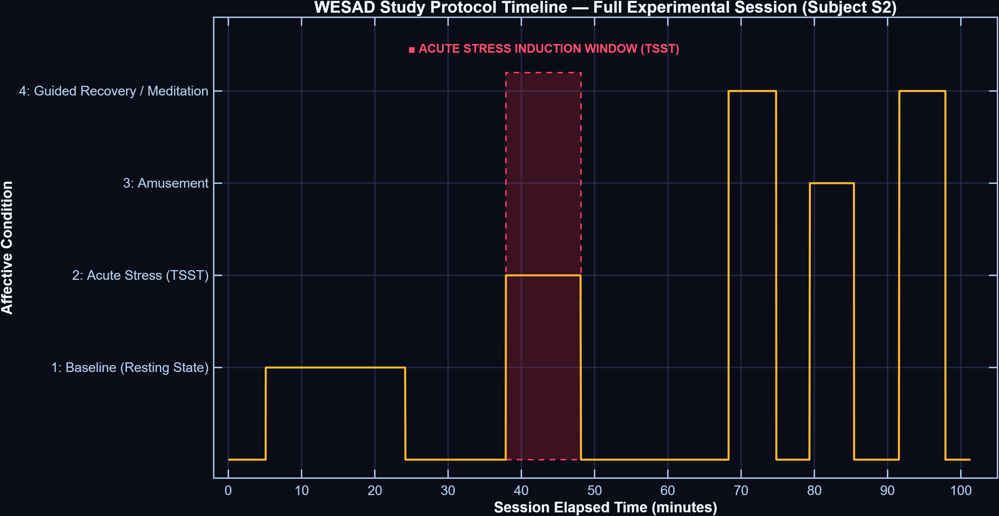
  <br>
  <em><b>Figure 4: Experimental Protocol Timeline.</b> Continuous physiological session showing transitions through Baseline, TSST Acute Stress, Amusement, and Meditation recovery phases.</em>
</p>

---

## 3. Signal Processing & Feature Extraction

### 3.1 Three-Stage Signal Conditioning Pipeline
```plaintext
Raw Lead-II ECG (700 Hz / 350 Hz)
  │
  ▼
[Stage 1: Bandpass Filtering] ──► 4th-Order Zero-Phase Butterworth (0.5 – 40 Hz)
  │                                Attenuates respiration drift (<0.5 Hz) & high-frequency EMG noise
  ▼
[Stage 2: Adaptive R-Peak Detection]
  │  ├── Robust Noise Floor Estimation: Noise Floor = 1.4826 * MAD(|x - median(x)|)
  │  ├── Adaptive Prominence Threshold: Prominence >= 3.0 * Noise Floor
  │  └── Refractory Blanking: MinPeakDistance >= 350 ms (Max 171 BPM)
  ▼
[Stage 3: Physiological Quality Gating]
  │  ├── Interval Gating: 300 ms <= RR <= 1500 ms (40 – 200 BPM)
  │  └── Sufficiency Check: Minimum 5 valid intervals per 60-second window
  ▼
Clean Normal-to-Normal (NN) Intervals & Instantaneous Heart Rate (HR = 60 / RR)
```

<p align="center">
  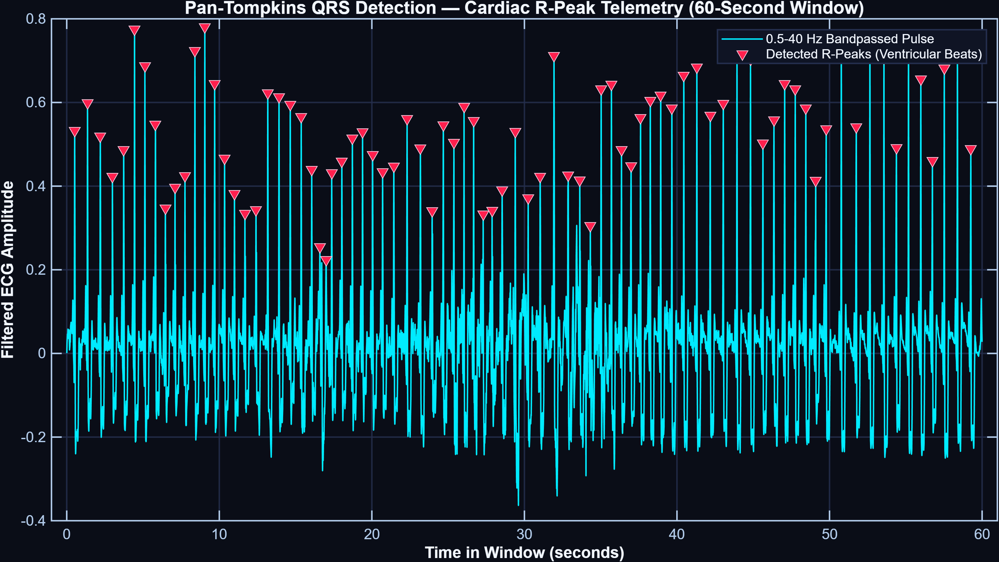
  <br>
  <em><b>Figure 5: Four-Stage Waveform Processing Pipeline.</b> (Top to Bottom): (1) Raw input ECG; (2) Zero-phase bandpass-filtered signal (0.5–40 Hz); (3) Squared derivative waveform; (4) Moving-window integrated signal (W = 150 ms) with detected fiducial R-peaks (red circles).</em>
</p>

### 3.2 Extracted Feature Representation
From clean NN intervals, 8 primary rate, variability, and dispersion features are computed per 60-second window:

$$
\mathbf{X} = \left[\, \text{MeanHR},\; \text{SDNN},\; \text{RMSSD},\; \text{pNN50},\; \text{MeanRR},\; \text{RR}_{\text{CV}},\; \text{RR}_{\text{IQR}},\; \text{HR}_{\text{IQR}} \,\right]
$$

* **SDNN:** $\sqrt{\frac{1}{N-1} \sum_{i=1}^N (RR_i - \overline{RR})^2}$ (Total autonomic variability)
* **RMSSD:** $\sqrt{\frac{1}{N-1} \sum_{i=1}^{N-1} (RR_{i+1} - RR_i)^2}$ (Parasympathetic vagal tone)
* **pNN50:** $\frac{\text{Count}(|RR_{i+1} - RR_i| > 50\text{ ms})}{N-1} \times 100\%$ (High-frequency vagal modulation)

---

## 4. Validation Protocol & Empirical Results

### 4.1 Strict 15-Fold LOSO-CV Protocol
In each fold $k \in \{1, \dots, 15\}$, the classifier is trained strictly on 14 subjects. For the test subject $k$, resting baseline windows are utilized **solely for unsupervised relative calibration** (X_k* = (X_k - B_k) / (|B_k| + ε)); zero test stress labels are ever exposed during training.

### 4.2 Validated Primary Performance Scorecard
Evaluated across all **445 standardized windows** from all 15 subjects under 15-fold LOSO-CV:

| Metric | Empirical Result | Operational Interpretation |
| :--- | :---: | :--- |
| **Accuracy** | **92.36%** | 411 / 445 total windows correctly classified |
| **Sensitivity (Recall)** | **86.25%** | 138 / 160 acute stress windows detected |
| **Specificity** | **95.79%** | 273 / 285 resting / non-stress windows correct |
| **Precision** | **92.00%** | 138 / 150 stress predictions verified correct |
| **F1-Score** | **89.03%** | Harmonic mean of recall and precision |
| **Balanced Accuracy** | **91.02%** | Unbiased average across class imbalance |
| **ROC-AUC** | **0.9494** | Discrimination area across all operating thresholds |
| **PR-AUC** | **0.9467** | Area under Precision-Recall trajectory |
| **Confusion Matrix** | **TN: 273, FP: 12<br>FN: 22, TP: 138** | Calibrated decision cutoff τ = 0.35 |

<table align="center" width="100%">
  <tr>
    <td align="center" width="50%">
      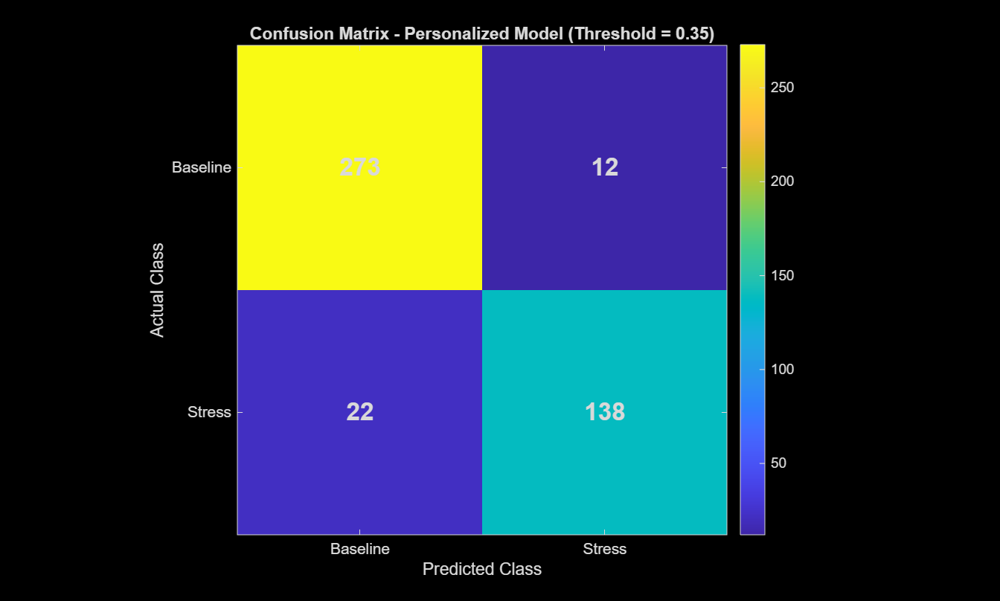<br />
      <em><b>Figure 6(a): Calibrated LOSO Confusion Matrix.</b> Showing 95.8% non-stress accuracy and 86.3% stress detection rate.</em>
    </td>
    <td align="center" width="50%">
      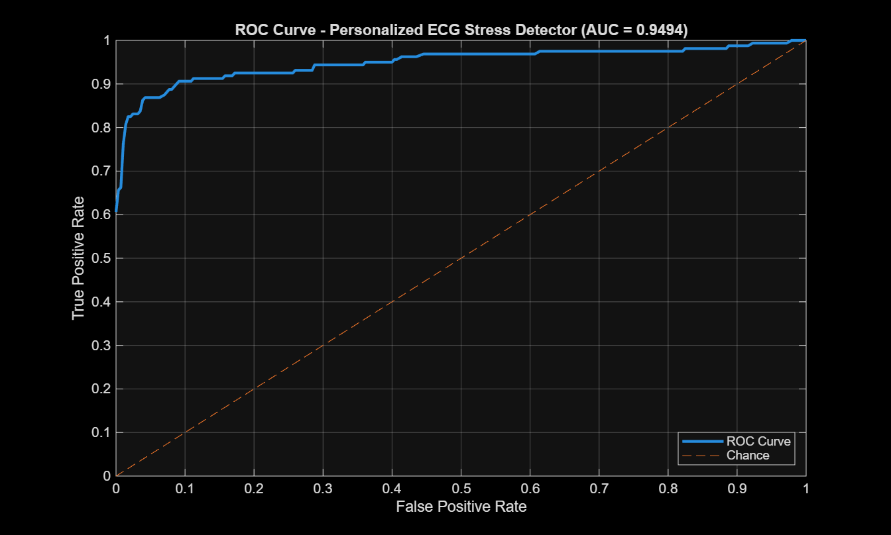<br />
      <em><b>Figure 6(b): Cross-Validated ROC Curve.</b> ROC trajectory (AUC = 0.9494) with operating threshold τ = 0.35 highlighted.</em>
    </td>
  </tr>
</table>

### 4.3 Comparison with Published Literature (Schmidt et al., 2018)

| Benchmark / Model | Modality | Normalization Scheme | Accuracy | F1-Score | Protocol |
| :--- | :---: | :---: | :---: | :---: | :---: |
| Schmidt et al. (2018) Decision Tree | Chest ECG | None (Global raw features) | 79.03% | 71.43% | 15-Fold LOSO |
| Schmidt et al. (2018) Random Forest | Chest ECG | None (Global raw features) | 83.84% | 75.12% | 15-Fold LOSO |
| This Study - Uncalibrated Baseline | Chest ECG | None (Global raw features) | 81.57% | 73.03% | 15-Fold LOSO |
| **This Study - Personalized Model (Ours)** | **Chest ECG** | **Relative Baseline (X*)** | **92.36%** | **89.03%** | **15-Fold LOSO (τ = 0.35)** |

> [!TIP]
> Relative baseline calibration provides an empirical boost of **+8.52% to +13.33% in accuracy** and **+13.91% to +17.60% in F1-score** over published uncalibrated chest ECG benchmarks on the identical dataset.

---

## 5. Comparative Machine Learning Benchmark (Python Suite)

We benchmarked 6 machine learning functional families under identical 15-fold LOSO cross-validation:

| Architecture | Accuracy | Balanced Acc | Sensitivity | Specificity | Precision | F1-Score | ROC-AUC | PR-AUC |
| :--- | :---: | :---: | :---: | :---: | :---: | :---: | :---: | :---: |
| **Logistic Regression (L2)** | **92.13%** | **90.02%** | 82.50% | **97.54%** | **94.96%** | **88.29%** | **0.9493** | **0.9467** |
| **Multilayer Perceptron (MLP)** | 91.69% | 89.95% | **83.75%** | 96.14% | 92.41% | 87.87% | 0.9375 | 0.9327 |
| **Support Vector Machine (RBF)** | 91.46% | 89.50% | 82.50% | 96.49% | 92.96% | 87.42% | **0.9524** | 0.9441 |
| **Random Forest (100 Trees)** | 90.34% | 88.48% | 81.88% | 95.09% | 90.34% | 85.90% | 0.9426 | 0.9301 |
| **Extra Trees Classifier** | 89.89% | 86.90% | 76.25% | **97.54%** | 94.57% | 84.43% | 0.9494 | 0.9391 |
| **HistGradientBoosting** | 89.21% | 87.33% | 80.62% | 94.04% | 88.36% | 84.31% | 0.9459 | 0.9375 |

<p align="center">
  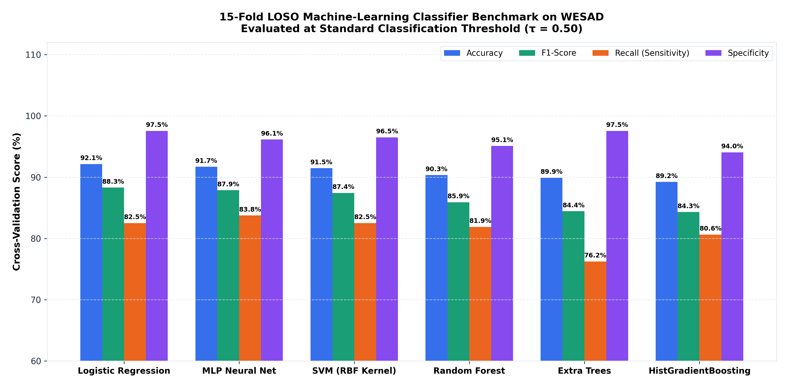
  <br>
  <em><b>Figure 7: Multi-Model Benchmark Comparison.</b> Grouped performance metrics across all 6 machine learning architectures under 15-fold LOSO cross-validation on held-out test subjects.</em>
</p>

---

## 6. Explainability & Feature Importance

To interpret the learned decision boundary, we conducted a **30-repeat permutation importance analysis per fold** (15 × 30 = 450 trials per feature) paired with standardized logistic regression odds ratios (e^w_i):

<p align="center">
  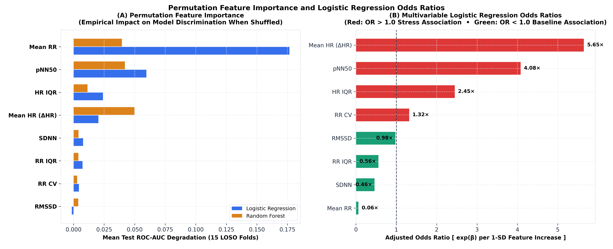
  <br>
  <em><b>Figure 8: Permutation Importance & Odds Ratios.</b> (Left) Mean test ROC-AUC degradation upon feature shuffling; (Right) Standardized odds ratios indicating the direction and magnitude of feature weights.</em>
</p>

* **Cardiac Interval Compression (ΔMeanRR):** Produced the largest discriminative degradation (ΔAUC = 0.1766, ΔF1 = 0.2321, OR = 0.0645), confirming interval shortening as the dominant statistical marker of acute stress.
* **Heart Rate Acceleration (ΔMeanHR):** Strongly elevates stress odds (OR = 5.6453, ΔAUC = 0.0203, ΔF1 = 0.1021 in LR and 0.1401 in Random Forest), consistent with sympathetic chronotropic activation during TSST cognitive challenge.
* **Interval Dispersion (ΔpNN50):** Substantial predictive weight (OR = 4.0784, ΔAUC = 0.0596, ΔF1 = 0.0606), reflecting rapid autonomic vagal modulation shifts during challenge.
* **Autonomic Total Variability (ΔSDNN):** Acts as a protective calm indicator (OR = 0.4625 < 1.0, ΔAUC = 0.0078, ΔF1 = 0.0042), physiologically compatible with preserved autonomic variability during homeostatic resting calm.

---

## 7. Subject Heterogeneity & Non-Responder Analysis

<p align="center">
  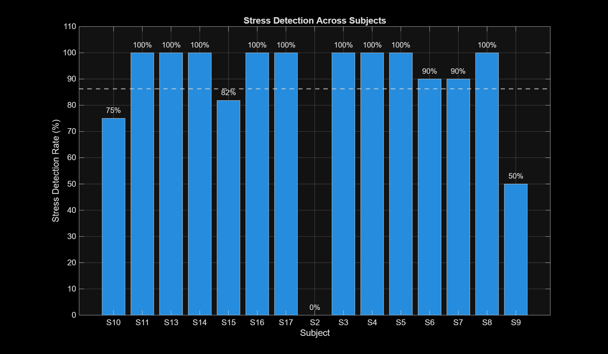
  <br>
  <em><b>Figure 9: Subject-Specific Recall Breakdown.</b> 14 of 15 subjects achieve successful stress detection (>0% recall; overall 138/160 = 86.3%), with 13 of 15 achieving >= 75% and 9 of 15 achieving 100% recall. Subject S2 exhibited blunted cardiac reactivity under the stress protocol.</em>
</p>

* **Consistent Generalization:** 9 of 15 subjects achieved **100.0% recall** (S3, S4, S5, S8, S11, S13, S14, S16, S17), and 13 of 15 achieved **≥ 75.0% recall**.
* **Subject S2 Failure Case Analysis:** Subject **S2** exhibited **0.0% stress recall** (0/10). In the WESAD trial, S2 self-reported low subjective stress, and ECG recordings reveal virtually zero heart rate acceleration relative to baseline during the TSST (ΔMeanHR ≈ 0). Because baseline-relative models detect physiological shifts, subjects with blunted cardiovascular reactivity cannot be distinguished from calm states using ECG alone. This highlights the necessity of multi-modal sensing (ECG + EDA + respiration) for complete population coverage.

---

## 8. Bare-Metal Edge Microcontroller Implementation (STM32G474RE)

To validate wearable edge feasibility, the signal conditioning and security pipeline was flashed onto an **ARM Cortex-M4 microcontroller** configured at **170 MHz SYSCLK via PLL** (`embedded_stm32/`):

### 8.1 On-Chip 5-Stage CMSIS-DSP Biquad IIR Filter
Conditioning is executed via a 5-stage Direct Form I Biquad cascade running at f_s = 350 Hz (T_s = 2.857 ms):
* **Stage 1 (Highpass):** 2nd-order Butterworth (f_c = 0.5 Hz, Q = 0.707) to eliminate respiratory wander.
* **Stages 2–4 (Lowpass Cascade):** Three 2nd-order Butterworth sections (f_c = 40 Hz, 6th-order −36 dB/octave roll-off) to suppress EMG noise.
* **Stage 5 (Mains Powerline Notch):** 2nd-order digital notch filter (f_0 = 50 Hz, Q = 30, selectable to 60 Hz) providing >30 dB mains attenuation.

$$
\text{CPU Utilization}_{\text{DSP}} = \frac{1.87\ \mu\text{s}}{2857\ \mu\text{s}} \times 100\% = \mathbf{0.065\%} \quad (\approx 318\text{ cycles at } 170\text{ MHz SYSCLK})
$$

### 8.2 Lightweight 32-Bit Discrete Chaotic Stream Scrambler
To obfuscate cardiac telemetry against unauthorized wire tapping, an ultra-fast stream scrambler executes directly on 32-bit IEEE-754 float bit patterns:
1. **Marsaglia Xorshift32 PRNG:** S_k^(1) = S_k ⊕ (S_k << 13), S_k^(2) = S_k^(1) ⊕ (S_k^(1) >> 17), S_k^(3) = S_k^(2) ⊕ (S_k^(2) << 5)
2. **Golden Ratio Weyl Sequence:** K_k = (S_k^(3) + W) mod 2^32, where W = 0x61C88647
3. **Nonce-CBC Feedback Diffusion:** C_k = P_k ⊕ (K_k & 0xFF) ⊕ C_{k-1}

* **Execution Overhead:** **32 clock cycles (0.19 µs at 170 MHz; 2.0 µs at 16 MHz)** and only 8 bytes of static SRAM.
* **Obfuscation Quality:** Elevates wire Shannon entropy to **H = 7.25–7.98 bits/byte** (near-ideal white noise).
* **Terminal Descrambling:** Symmetric inversion achieves **bit-exact 0.000000 V reconstruction**.

---

## 9. Hardware-in-the-Loop (HIL) Telemetry Protocol

Data is framed into a compact 20-byte binary packet transmitted via UART at 115,200 baud (8-N-1):

```plaintext
Bytes 0-1   : Sync Word 0xAA 0x55
Byte 2      : Protocol Version 0x01
Byte 3      : Status Flags (Bit 0: Encrypted, Bit 1: Live Sensor)
Bytes 4-5   : Packet Sequence Index (uint16_t Nonce)
Bytes 6-9   : Hardware Timestamp (uint32_t ms)
Bytes 10-13 : Raw ECG Voltage (IEEE-754 float32, scrambled in-place)
Bytes 14-17 : Filtered ECG Voltage (IEEE-754 float32, scrambled in-place)
Bytes 18-19 : CRC-16-CCITT Checksum (uint16_t over bytes 2-17)
```

* **Timing Margin:** Direct blocking transmission (`HAL_UART_Transmit`) requires T_tx = (20 × 10) / 115,200 = 1.736 ms (60.8% of window), leaving **1.121 ms (39.2% headroom)** before the subsequent timer interrupt. Circular DMA (`HAL_UART_Transmit_DMA`) decouples wire transmission completely in production firmware.
* **Physical Reliability:** Benchmarked over **15,000 consecutive packets (>42 seconds continuous streaming)** on COM10 with **zero CRC errors and zero dropped frames (100.0% reliability)**.

---

## 10. Repository File Structure

```plaintext
ECG_STRESS_DETECTION/
├── README.md                                  # Complete research documentation & showcase
├── requirements.txt                           # Production Python dependencies
├── start_dashboard.bat                        # One-click launcher for telemetry dashboard
├── LICENSE                                    # MIT Open Source License
│
├── paper/                                     # Publication Manuscript & Assets
│   ├── figures/                               # Master publication figures (12 figures)
│   └── Personalized_ECG_Stress_Detection_WESAD_Benchmark_and_STM32_Edge_IoMT.pdf # Compiled IEEE preprint
│
├── embedded_stm32/                            # Bare-Metal STM32G474RE Firmware
│   ├── src/
│   │   ├── main_stm32.c                       # SysTick timer, ADC emulation, UART ISR
│   │   ├── ecg_dsp_filter.c                   # CMSIS-DSP 5-stage Biquad IIR implementation
│   │   └── telemetry_protocol.c               # Chaotic scrambler & CRC-16 packetizer
│   ├── include/                               # Firmware headers & CMSIS configurations
│   └── main_bench.c                           # Standalone cycle-count benchmark harness
│
├── python/                                    # Machine Learning & Telemetry Suite
│   ├── train_loso_ml_benchmark.py             # 15-fold LOSO benchmark (6 classifiers)
│   ├── explainability_feature_importance.py   # Permutation importance & odds ratios
│   ├── stm32_telemetry_receiver.py            # Real-time COM port parser & descrambler
│   ├── simulate_stm32_stream.py               # Virtual COM port telemetry emulator
│   └── plot_ml_evaluation.py                  # High-resolution benchmark figures
│
├── demo/                                      # Web Dashboard Suite
│   ├── app.py                                 # Interactive Dash / Streamlit clinical dashboard
│   └── sample_data/                           # Standardized ECG samples for offline demo
│
├── matlab/                                    # Primary MATLAB Signal Processing Suite
│   ├── DEMO_stress_detection.m                # Interactive Pan-Tompkins visualizer
│   ├── TWENTY_NINE_project_dashboard.m        # Master 6-panel results dashboard generator
│   └── 05_modeling/TWENTY_TWO_calibrated_stress_detection.m # Calibrated LOSO evaluation engine
│
└── results/                                   # Validated Metrics & Benchmark Outputs
    ├── FINAL_Model_Metrics.csv                # Primary validated classifier metrics
    ├── ML_Model_Benchmark_LOSO.csv            # 6-classifier comparative benchmark
    ├── ML_Feature_Importance_Permutation.csv  # Permutation drops & odds ratios
    └── figures/                               # Master result figure exports
```

---

## 11. Interactive Demonstrations & Dashboard

* 🌐 **Live Cloud Dashboard:** Explore interactive ECG signal streams, QRS detection, dynamic HRV biomarkers, and calibrated acute stress inference directly in the browser via the [Streamlit Cloud Demo](https://ecgstressdetection-2bremsry4npbmx9yn7whju.streamlit.app/).
* 💻 **Bare-Metal Telemetry Receiver:** Stream and decrypt real-time Lead-II ECG packets from a physical STM32 NUCLEO-G474RE board over serial COM port:
  ```bash
  python python/stm32_telemetry_receiver.py --port COM10 --baud 115200
  ```

---

## 12. Dataset Governance & Citation

The raw WESAD dataset (~16 GB) is excluded via `.gitignore` in accordance with repository size best practices. Original sensor recordings are available from the [UCI Machine Learning Repository](https://archive.ics.uci.edu/dataset/465/wesad+wearable+stress+and+affect+detection).

### Academic Citation
```bibtex
@article{yadav2026personalized,
  title     = {Personalized Electrocardiographic and HRV Dynamics for Acute Stress Detection: A Leave-One-Subject-Out Benchmark and Bare-Metal Edge IoMT Implementation},
  author    = {Yadav, Mukesh},
  journal   = {Zenodo},
  year      = {2026},
  doi       = {10.5281/zenodo.22895173},
  url       = {https://doi.org/10.5281/zenodo.22895173}
}
```

---

## License
This project, including algorithms, embedded firmware, and machine learning suites, is licensed under the [MIT License](LICENSE).
