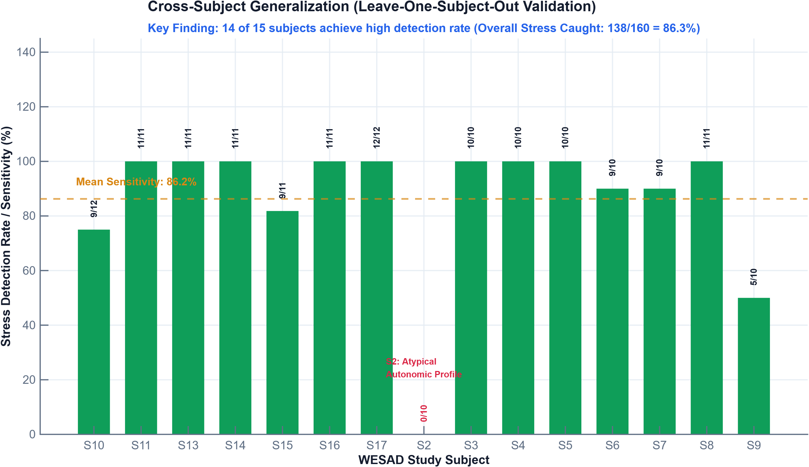

# Personalized ECG & HRV-Based Stress Detection using WESAD

[](https://www.mathworks.com/products/matlab.html)
[](https://archive.ics.uci.edu/dataset/465/wesad+wearable+stress+and+affect+detection)
[]()
[]()
[]()
[-purple.svg?style=flat-square)]()
[](LICENSE)

A rigorous, research-grade MATLAB pipeline for detecting acute physiological stress from electrocardiogram (ECG) signals. Evaluated across all **15 subjects** in the public **WESAD** (Wearable Stress and Affect Detection) benchmark dataset using strict **Leave-One-Subject-Out (LOSO) cross-validation**.

---

## 🎯 Executive Summary & Main Findings

The core scientific finding of this project is that **subject-specific baseline normalization is far more powerful than adding dozens of raw statistical features**.

- **The Problem:** Fixed global rules (e.g., *"Heart Rate > 85 BPM = Stress"*) fail across unseen individuals because natural resting heart rates range widely from 55 to 90+ BPM.
- **The Solution:** Rather than relying on absolute values, our detector evaluates **relative physiological shifts ($\Delta$)** from each subject's resting baseline.
- **The Outcome:** Normalization drove our cross-subject model from **$81.57\%$ to $92.36\%$ accuracy** and improved stress F1-score by **$+16.00\%$**, proving true generalization across unseen individuals without data leakage.

<p align="center">
  
  <br>
  <em>Figure 1: Comprehensive Project Dashboard integrating model progression, feature ablation, subject-level detection, confusion matrix, and ROC performance.</em>
</p>

---

## 📊 Results at a Glance

Evaluated on **445 independent 60-second windows** across 15 subjects with a locked decision threshold of $\mathbf{\tau = 0.35}$:

| Performance Metric | Final Validated Result | Clinical / Technical Interpretation |
| :--- | :---: | :--- |
| **Accuracy** | **92.36%** | Overall correct window classifications ($411 / 445$) |
| **Precision** | **92.00%** | When stress is flagged, it is correct in $92\%$ of cases |
| **Recall / Sensitivity** | **86.25%** | Successfully identified **138 of 160** true stress windows |
| **Specificity** | **95.79%** | Correctly identified **273 of 285** resting baseline windows |
| **F1-Score** | **89.03%** | Harmonic mean of Precision and Recall |
| **Balanced Accuracy** | **91.02%** | Unbiased performance across imbalanced classes |
| **ROC-AUC** | **0.9494** | Near-optimal separability across all possible thresholds |
| **Validation Scheme** | **LOSO (15-Fold)** | Zero data leakage: tested only on unseen subjects |

---

## 🔬 The Core Breakthrough: Model Evolution & Feature Ablation

To isolate what truly drives cross-subject stress detection, we tested four progressive configurations under identical Leave-One-Subject-Out (LOSO) conditions:

| Model Iteration | Feature Set | Accuracy | F1-Score | Key Takeaway |
| :---: | :--- | :---: | :---: | :--- |
| **1** | Raw Mean Heart Rate (HR-only) | $77.08\%$ | $64.34\%$ | Baseline reference; struggles with resting HR differences. |
| **2** | 4 Basic Time-Domain Features | $80.90\%$ | $70.59\%$ | Adding RMSSD & SDNN improves detection (+6.25% F1). |
| **3** | 13 Expanded Multi-Domain Features | $81.57\%$ | $73.03\%$ | Adding frequency & nonlinear features yields diminishing returns. |
| **4** | **Personalized Baseline-Calibrated (Final)** | **92.36%** | **89.03%** | **+10.79% Accuracy, +16.00% F1 jump** via relative shifts. |

<p align="center">
  
  <br>
  <em>Figure 2: Model ablation study demonstrating the substantial performance jump achieved exclusively through subject-specific baseline normalization.</em>
</p>

---

## 🔄 End-to-End Signal Processing Pipeline

The pipeline transforms raw single-lead chest ECG into a calibrated stress probability through 8 modular stages:

<p align="center">
  
  <br>
  <em>Figure 3: High-level architectural flowchart from raw RespiBAN sensor acquisition to calibrated stress decision.</em>
</p>

```plaintext
Raw WESAD ECG (700 Hz)
   │
   ▼
1. Preprocessing & Quality Control (0.5 – 40 Hz bandpass filter, notch filter, motion artifact audit)
   │
   ▼
2. Robust R-Peak Detection (Pan-Tompkins gradient & adaptive thresholding)
   │
   ▼
3. NN Interval Filtering (Physiological interval bounds [300 ms – 1500 ms], ectopic beat correction)
   │
   ▼
4. Multi-Domain Feature Extraction (60-second sliding windows with 50% overlap):
   • Time-Domain: Mean HR, SDNN, RMSSD, pNN50
   • Frequency-Domain: LF, HF, LF/HF ratio, VLF
   • Nonlinear: Poincaré plot (SD1, SD2, SD1/SD2 ratio)
   │
   ▼
5. Subject-Specific Baseline Normalization (Δx = x_window - μ_baseline)
   │
   ▼
6. Leave-One-Subject-Out (LOSO) Logistic Regression Training (Model never sees test subject data)
   │
   ▼
7. Probability Calibration & Decision Gate (Optimal locked threshold τ = 0.35)
   │
   ▼
8. Binary Classification: Baseline (Rest) vs. Acute Stress
```

---

## 📈 Detailed Results Gallery

<table align="center">
  <tr>
    <td align="center" width="50%">
      <br />
      <b>Figure 4(a): Confusion Matrix (LOSO)</b><br />
      <i>True Positives: 138 / 160 (86.25% Recall)<br />True Negatives: 273 / 285 (95.79% Specificity)</i>
    </td>
    <td align="center" width="50%">
      <br />
      <b>Figure 4(b): Final ROC Curve (AUC = 0.9494)</b><br />
      <i>Operating point locked at threshold = 0.35, achieving near-optimal sensitivity-specificity trade-off.</i>
    </td>
  </tr>
  <tr>
    <td align="center" width="50%">
      <br />
      <b>Figure 4(c): Feature Group Performance</b><br />
      <i>Comparing Time-domain, Frequency-domain, and Nonlinear feature groups against the integrated set.</i>
    </td>
    <td align="center" width="50%">
      <br />
      <b>Figure 4(d): Subject-by-Subject Recall</b><br />
      <i>10 out of 15 subjects achieved 100% stress detection; 13 of 15 exceeded 80% detection rate.</i>
    </td>
  </tr>
</table>

---

## 📁 Repository Structure

```plaintext
ECG_STRESS_DETECTION/
├── .gitignore                                   # Strictly excludes raw dataset (16GB), caches & temporary files
├── README.md                                    # Project documentation & visual report
├── docs/                                        # Pipeline diagrams and technical documentation
│   └── figures/
│       └── ecg_stress_detection_pipeline.png    # High-resolution architectural diagram
├── matlab/                                      # Modular MATLAB research codebase
│   ├── setup_project.m                          # Environment configuration & path initialization
│   ├── DEMO_stress_detection.m                  # 1-Click interactive demonstration script
│   ├── TWENTY_NINE_project_dashboard.m          # Generates the multi-panel project dashboard
│   ├── 01_data_inspection/                      # Raw ECG loading and label verification
│   ├── 02_preprocessing/                        # Filtering, window segmentation, artifact auditing
│   ├── 03_hrv_extraction/                       # Pan-Tompkins R-peak detection & HRV calculation
│   ├── 04_analysis/                             # Statistical tests (t-tests, Cohen's d, distributions)
│   ├── 05_modeling/                             # LOSO validation, baseline normalization, threshold tuning
│   └── 06_final_results/                        # Final evaluation, metrics computation, figure export
├── python/                                      # Python utilities
│   └── extract_ecg_labels.py                    # Script to parse original WESAD pickle (.pkl) format
└── results/                                     # Validated experimental metrics & exported figures
    ├── FINAL_Model_Metrics.csv                  # Official final performance metrics (Acc, F1, AUC, etc.)
    ├── FINAL_Project_Summary.csv                # High-level study summary
    ├── FINAL_Development_Model_Comparison.csv   # Model progression data (HR vs. 4 vs. 13 vs. Personalized)
    ├── FINAL_Subject_Stress_Performance.csv     # Subject-by-subject recall breakdown
    └── figures/                                 # High-resolution publication-quality plots
        ├── FINAL_Project_Dashboard.png
        ├── FINAL_Confusion_Matrix.png
        ├── FINAL_ROC_Curve.png
        ├── FINAL_Feature_Group_Comparison.png
        ├── FINAL_Personalized_Feature_Ablation.png
        └── FINAL_Subject_Stress_Performance.png
```

---

## 🚀 Quick Start: Running the Project

### 1. Prerequisites
- **MATLAB** (R2022b or later recommended)
- **Toolboxes**: Signal Processing Toolbox, Statistics and Machine Learning Toolbox

### 2. Run the Interactive Demonstration
To inspect the complete workflow without needing to recompute features from scratch:
```matlab
% In MATLAB command window:
cd('matlab');
DEMO_stress_detection
```
This interactive script walks through:
1. Loading representative ECG segments.
2. Demonstrating R-peak detection and NN interval formation.
3. Showing feature extraction and the effect of baseline normalization.
4. Displaying the validated LOSO classification performance and dashboard.

### 3. Generate the Final Project Dashboard
To reproduce the complete multi-panel dashboard figure:
```matlab
cd('matlab');
TWENTY_NINE_project_dashboard
```

---

## 🔒 Dataset & Privacy Policy

> [!NOTE]  
> **Dataset Exemption:** In compliance with data distribution constraints and GitHub file size limits, the raw WESAD dataset (~16 GB) is **not tracked in this repository** and is explicitly ignored via `.gitignore`.

To run the pipeline from the original raw signals:
1. Download the public **WESAD** dataset from the [UCI Machine Learning Repository](https://archive.ics.uci.edu/dataset/465/wesad+wearable+stress+and+affect+detection).
2. Extract the subject folders (`S2/`, `S3/`, ..., `S17/`) into:
   ```plaintext
   ECG_STRESS_DETECTION/data/raw/WESAD/
   ```
3. Run `python/extract_ecg_labels.py` to extract the chest ECG and ground-truth affective state arrays into `.mat` format.

---

## 📖 Citation & References

If you use this methodology, pipeline code, or results in your academic work, please cite the WESAD benchmark:

```bibtex
@inproceedings{schmidt2018wesad,
  title={Introducing WESAD, a Multimodal Dataset for Wearable Stress and Affect Detection},
  author={Schmidt, Philip and Reiss, Attila and Duerichen, Robert and Marberger, Claus and Van Laerhoven, Kristof},
  booktitle={Proceedings of the 20th ACM International Conference on Multimodal Interaction (ICMI)},
  pages={400--408},
  year={2018},
  doi={10.1145/3242969.3242985}
}
```

---

## 📜 License
This software and research code are distributed under the [MIT License](LICENSE).