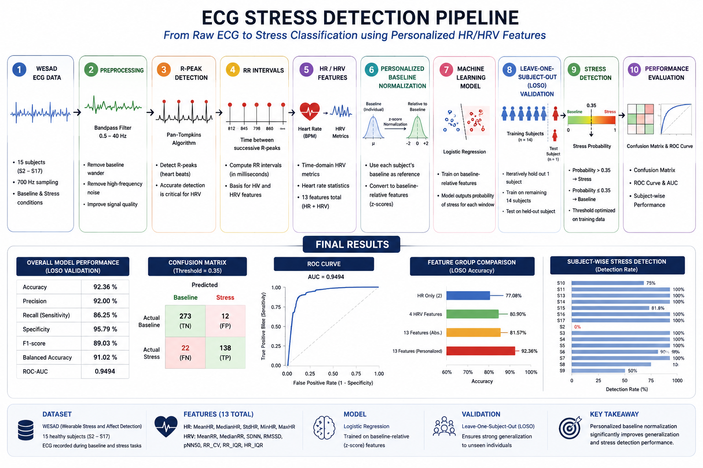
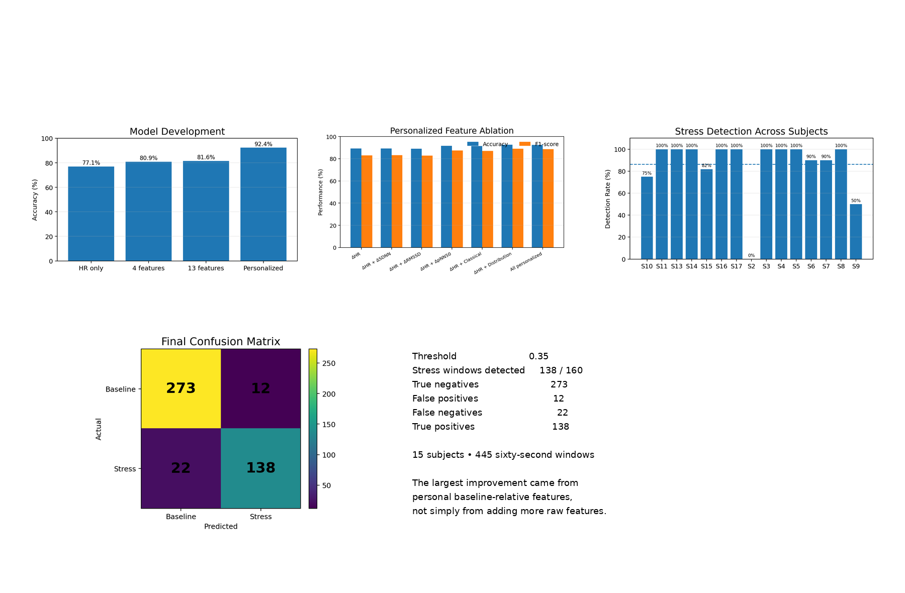

\# ECG Stress Detection using WESAD


\### Personalized ECG/HRV-Based Stress Detection in MATLAB


A research-oriented MATLAB pipeline for detecting physiological stress from ECG signals using heart-rate and heart-rate-variability (HRV) features, subject-specific baseline normalization, and leave-one-subject-out (LOSO) validation.


\---


\## Results at a Glance


| Metric | Final Result |

|---|---:|

| \*\*Accuracy\*\* | \*\*92.36%\*\* |

| \*\*Precision\*\* | \*\*92.00%\*\* |

| \*\*Recall / Sensitivity\*\* | \*\*86.25%\*\* |

| \*\*Specificity\*\* | \*\*95.79%\*\* |

| \*\*F1-score\*\* | \*\*89.03%\*\* |

| \*\*Balanced Accuracy\*\* | \*\*91.02%\*\* |

| \*\*ROC-AUC\*\* | \*\*0.9494\*\* |

| Subjects | 15 |

| 60-second windows | 445 |

| Locked decision threshold | 0.35 |


The final calibrated detector identified \*\*138 of 160 stress windows\*\*, corresponding to \*\*86.25% stress recall\*\*.


\---


\## Why This Project?


Stress produces measurable changes in cardiovascular physiology, but those changes are not identical for every individual.


A simple global rule such as:


> "Heart rate above X BPM = stress"


can fail because different people have different resting heart rates and HRV characteristics.


This project therefore investigates two questions:


1\. \*\*Can ECG-derived HR and HRV features distinguish baseline from stress?\*\*

2\. \*\*Does personal baseline normalization improve detection across unseen subjects?\*\*


The main finding was that \*\*personalization was substantially more useful than simply adding more raw features.\*\*


\---


\## Project Pipeline





\## Final Project Dashboard

The dashboard below brings together the main evidence from the project in one view: model development, personalized feature experiments, subject-wise detection, the final confusion matrix, ROC performance, and the final evaluation metrics.




### Processing flow

```text
WESAD ECG
   │
   ▼
ECG preprocessing
   │
   ▼
R-peak detection
   │
   ▼
RR intervals
   │
   ▼
HR / HRV feature extraction
   │
   ▼
Subject-specific baseline normalization
   │
   ▼
Logistic regression
   │
   ▼
Leave-One-Subject-Out validation
   │
   ▼
Stress probability
   │
   ▼
Locked threshold = 0.35
   │
   ▼
Baseline / Stress classification
```