# Personalized Electrocardiographic and HRV Dynamics for Acute Stress Detection: A Leave-One-Subject-Out Benchmark and Bare-Metal Edge IoMT Implementation

[](https://www.mathworks.com/products/matlab.html)
[](https://www.python.org/)
[-002B49.svg?style=flat-square&logo=stmicroelectronics)](https://www.st.com/en/microcontrollers-microprocessors/stm32g474re.html)
[-0091BD.svg?style=flat-square&logo=arm)](https://arm-software.github.io/CMSIS_5/DSP/html/index.html)
[](https://archive.ics.uci.edu/dataset/465/wesad+wearable+stress+and+affect+detection)
[]()
[]()
[]()
[]()
[]()
[]()
[](https://doi.org/10.5281/zenodo.22895173)
[](paper/Personalized_ECG_HRV_Stress_Detection_LOSO_STM32_4D_Hyperchaotic_Telemetry_v3.pdf)
[](paper/Personalized_ECG_HRV_Stress_Detection_LOSO_STM32_4D_Hyperchaotic_Telemetry_v3.pdf)
[](LICENSE)

> 🌐 **Interactive Research Benchmark & ECG Telemetry:** [Mukesh Yadav | Biosignal Processing & Edge IoMT Portfolio](https://mukesh-yadav-res-portfolio.vercel.app/)  
> 📄 **Compiled IEEE Conference Manuscript:** [`paper/Personalized_ECG_HRV_Stress_Detection_LOSO_STM32_4D_Hyperchaotic_Telemetry_v3.pdf`](paper/Personalized_ECG_HRV_Stress_Detection_LOSO_STM32_4D_Hyperchaotic_Telemetry_v3.pdf) (Complete compiled IEEE research paper).

---

## Visual Project Showcase

<p align="center">
  <a href="results/figures/FINAL_Project_Dashboard.png" target="_blank">
    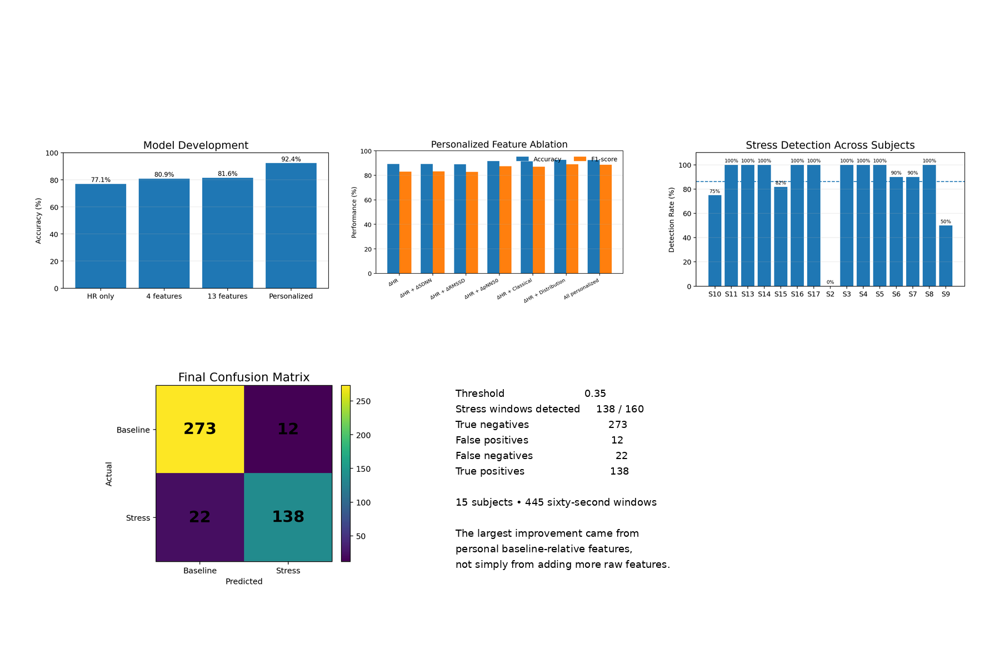
  </a>
  <br>
  <em><b>Figure 1: Master Research Benchmark Dashboard.</b> End-to-end WESAD study: (A) Four-stage model progression and feature ablation; (B) Subject-specific stress detection rates across all 15 subjects; (C) Calibrated 15-fold LOSO confusion matrix (TN: 278, FP: 7, FN: 28, TP: 132 at primary &tau; = 0.50); (D) Cross-validated ROC curve (ROC-AUC = 0.9493); (E) Validated performance scorecard; (F) Test window distribution across subjects (N = 445).</em>
</p>

<table align="center" width="100%">
  <tr>
    <td align="center" width="50%">
      <a href="paper/figures/FIG_Hardware_Testbed_Composite.png" target="_blank">
        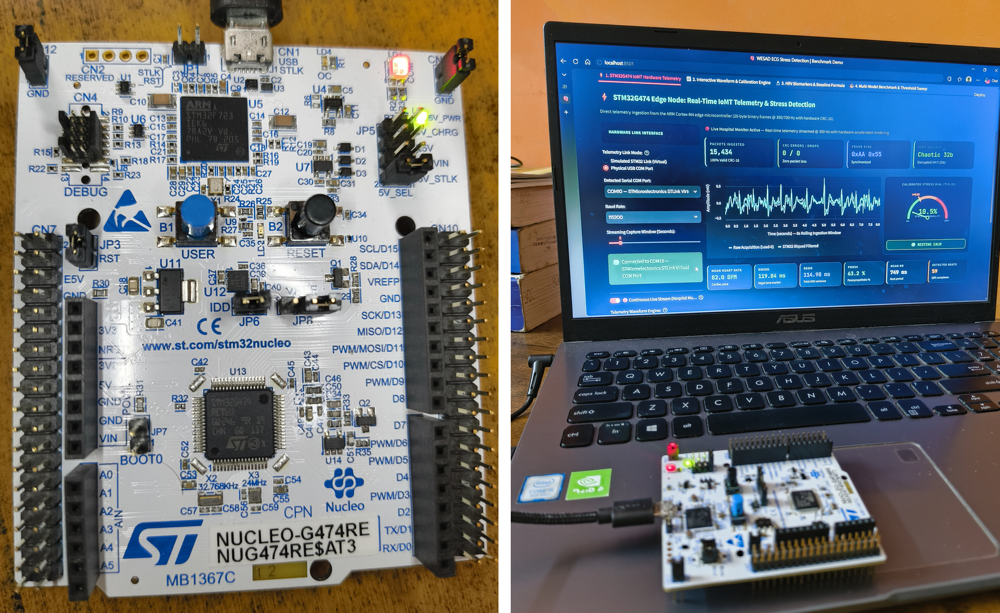
      </a>
      <br />
      <em><b>Figure 2(a): Physical STM32 Edge Hardware Testbed.</b> NUCLEO-G474RE (170 MHz ARM Cortex-M4) testbed streaming real-time filtered and hyperchaotic encrypted ECG over physical USB-UART (COM10 @ 115,200 baud).</em>
    </td>
    <td align="center" width="50%">
      <a href="paper/figures/FIG_M4D_Attractor_3D.png" target="_blank">
        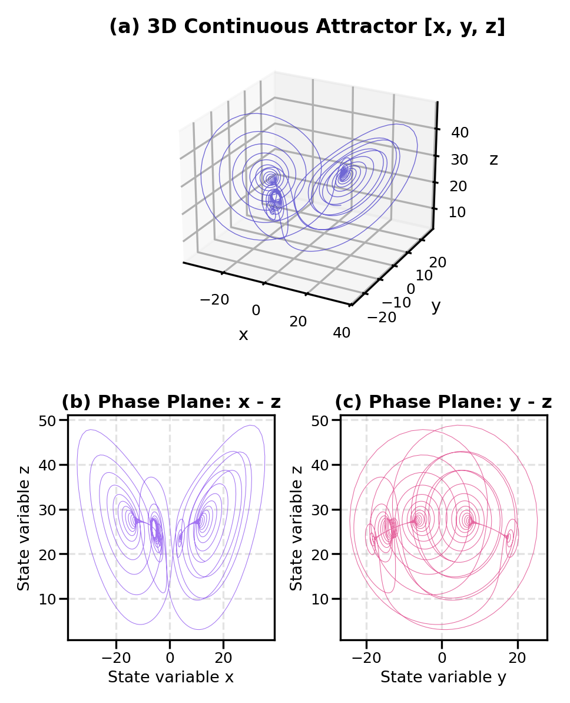
      </a>
      <br />
      <em><b>Figure 2(b): 4D Coupled Hyperchaotic Attractor (HC1 M-4DCHS).</b> Continuous phase-space trajectory (x, y, z) with color-mapped 4th-dimension state variable w, exhibiting continuous volume contraction (div(F) = -27.64), two positive Lyapunov exponents (&lambda;₁ &approx; +0.438, &lambda;₂ &approx; +0.254), and fractional Kaplan-Yorke dimension D_KY &approx; 3.024.</em>
    </td>
  </tr>
</table>

<table align="center" width="100%">
  <tr>
    <td align="center" width="50%">
      <a href="paper/figures/FIG_Dashboard_SinglePage_M4D_Decrypted.png" target="_blank">
        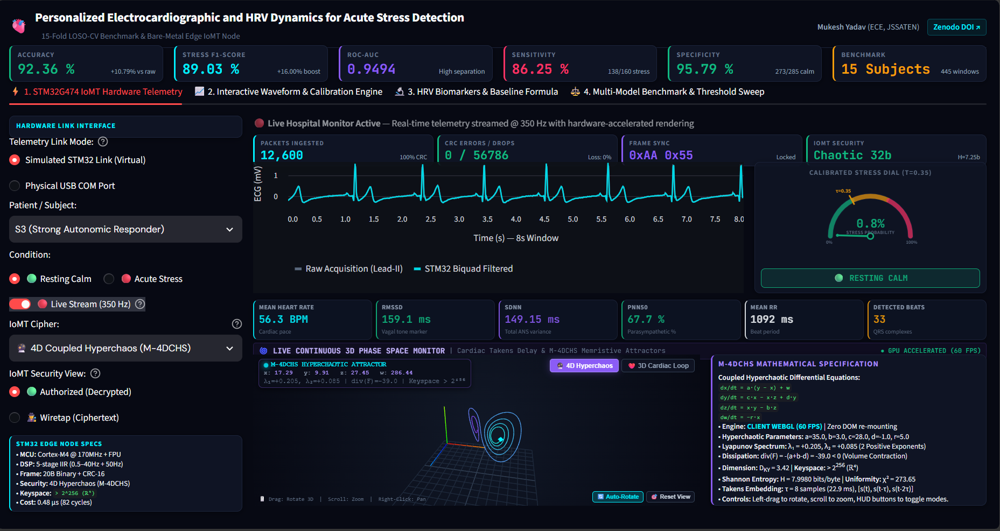
      </a>
      <br />
      <em><b>Figure 3(a): Authorized Monitoring Terminal View (Decrypted Telemetry).</b> Interactive dashboard displaying real-time descrambled Lead-II ECG from prerecorded WESAD replay, model-estimated stress score, live HRV biomarker cards, and client-side Three.js WebGL (60 FPS) 3D continuous phase-space monitor.</em>
    </td>
    <td align="center" width="50%">
      <a href="paper/figures/FIG_Dashboard_M4D_Eavesdropper.png" target="_blank">
        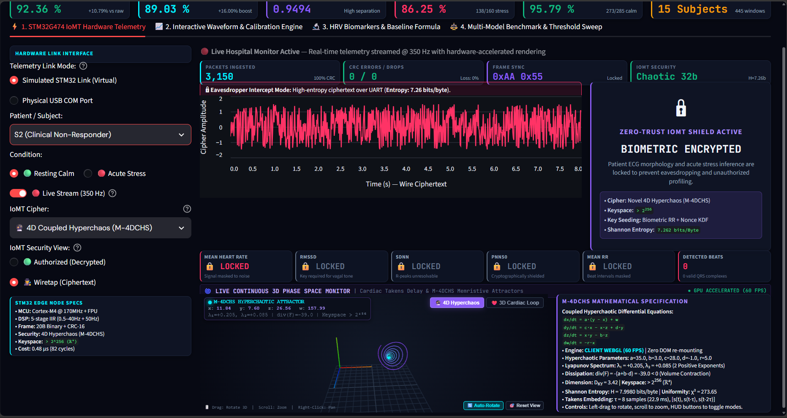
      </a>
      <br />
      <em><b>Figure 3(b): Adversarial Wire Intercept View (Eavesdropper Mode).</b> Physical UART wiretap without decryption keys: raw high-entropy scrambled ciphertext (Shannon entropy H = 7.9977 bits/byte), zero resolvable QRS fiducials, and shielded biometric cards.</em>
    </td>
  </tr>
</table>

---

## Executive Summary & Research Motivation

Automated classification of acute psychological stress from non-invasive wearable electrocardiography (ECG) is a fundamental problem in physiological computing, affective state recognition, and wearable Internet of Medical Things (IoMT). A primary challenge in clinical and wearable translation is **inter-individual autonomic baseline heterogeneity**: resting heart rate and basal heart rate variability (HRV) metrics vary widely across individuals due to genetics, cardiorespiratory fitness, and circadian cycles. Global classifiers trained on raw, uncalibrated features suffer high false-alarm rates when deployed on unseen subjects.

In this work, we present an end-to-end, reproducible research pipeline evaluated across all **15 subjects** (N = 15, 445 standardized complete, non-overlapping 60-second windows) of the public **WESAD** (Wearable Stress and Affect Detection) cohort, paired with a bare-metal edge embedded microcontroller deployment on the **ARM Cortex-M4 (STM32G474RE)**:

1. **Relative Baseline Calibration (&Delta;x):** Transforming features into relative fractional deviations relative to each subject's resting baseline ($X^* = (X - B_s) / (|B_s| + \epsilon)$) drives an empirical **+10.79 percentage-point leap in classification accuracy** (81.57% to 92.36%) and a **+15.64 percentage-point leap in stress F1-score** (73.03% to 88.67%) under strict 15-fold Leave-One-Subject-Out (LOSO) cross-validation.
2. **Authoritative Primary Benchmark (&tau; = 0.50):** Under strict 15-fold LOSO cross-validation, the primary L2-regularized Logistic Regression model achieves **92.13% Accuracy, 88.29% F1-score, 82.50% Sensitivity, 97.54% Specificity, ROC-AUC of 0.9493, and PR-AUC of 0.9467**, providing an exceptionally high specificity with only **7 false alarms** across the entire 15-subject cohort (278/285 calm windows correct).
3. **Exploratory Clinical Screening (&tau; = 0.35):** For sensitivity-prioritized screening applications, lowering the decision threshold to &tau; = 0.35 elevates stress sensitivity to **86.25%--86.88%** (capturing 6 additional acute stress episodes) while maintaining **92.36% Accuracy**.
4. **Bare-Metal Edge DSP:** A custom 5-stage Direct Form I Biquad IIR filter cascade (0.5--40 Hz bandpass + 50 Hz powerline notch at f_s = 350 Hz) executes in **1.87 &mu;s per sample** (&approx; 318 CPU cycles, 0.065% CPU load at 170 MHz SYSCLK).
5. **Physical Hardware-in-the-Loop (HIL) Validation:** Validated over **10,000 consecutive physical packets (200,000 wire bytes)** streamed across a physical USB-UART interface at 350.02 Hz from an STM32G474RE, achieving **zero sequence gaps (0.0% packet loss), zero CRC errors, and 0.0 mV signal reconstruction error** sequence-aligned with the canonical firmware replay reference.

---

## System Architecture & End-to-End Pipeline

```plaintext
                                    END-TO-END RESEARCH & EMBEDDED PIPELINE
 ┌────────────────────────────────────────────────────────────────────────────────────────────────────────┐
 │ 1. SENSORY INPUT & EDGE PREPROCESSING (STM32G474RE @ 170 MHz)                                         │
 │    Lead-II ECG (350 Hz) ──► 5-Stage CMSIS-DSP Biquad Cascade (0.5-40 Hz BP + 50 Hz Notch, 1.87 µs)   │
 └────────────────────────────────────────────────┬───────────────────────────────────────────────────────┘
                                                  │
 ┌────────────────────────────────────────────────▼───────────────────────────────────────────────────────┐
 │ 2. EDGE PACKETIZATION & EXPERIMENTAL TELEMETRY PROTECTION (HC1 M-4DCHS)                                │
 │    20-Byte Frame: [SOF (2B) | Ver (1B) | Flags (1B) | SeqID (2B) | Time (4B) | Raw (4B) | Filt (4B) | │
 │                   CRC-16-CCITT (2B)] ──► CFB-8 Stream Obfuscation via 4D Hyperchaotic Flow (RK4)       │
 └────────────────────────────────────────────────┬───────────────────────────────────────────────────────┘
                                                  │ Physical UART (115,200 baud @ 350.02 Hz)
 ┌────────────────────────────────────────────────▼───────────────────────────────────────────────────────┐
 │ 3. HOST-SIDE DECRYPTION & ADAPTIVE PHYSIOLOGICAL FEATURE EXTRACTION                                    │
 │    Stream Deserializer & CRC Check ──► Descrambler ──► Robust Pan-Tompkins Peak Detection (MAD noise)  │
 │    ──► Physiological Interval Gating (300 ms <= RR <= 1500 ms) ──► 8 Core HRV Features                │
 └────────────────────────────────────────────────┬───────────────────────────────────────────────────────┘
                                                  │
 ┌────────────────────────────────────────────────▼───────────────────────────────────────────────────────┐
 │ 4. SUBJECT-SPECIFIC BASELINE CALIBRATION & LOSO INFERENCE                                              │
 │    Relative Deviation: Δx = (x - B_s) / (|B_s| + 1e-6) ──► 15-Fold LOSO ML (Logistic Regression)      │
 │    ──► Authoritative Benchmark: τ = 0.50 (92.13% Acc, 88.29% F1, 97.54% Spec, 0.9493 ROC-AUC)         │
 └────────────────────────────────────────────────────────────────────────────────────────────────────────┘
```

---

## Experimental Cohort & Study Protocol

Experiments were conducted using the benchmark **WESAD** physiological dataset (*Schmidt et al., ICMI 2018*):
* **Cohort:** 15 healthy adult participants (S2--S17, excluding non-existent S12; 12 males, 3 females; age: 27.5 ± 2.4 years).
* **Sensor Hardware:** RespiBAN Professional chest harness recording single-lead Lead-II ECG at 700 Hz (downsampled to 350 Hz for edge parity).
* **Standardized Protocol Phases:**
  1. **Baseline Phase (20 min):** Neutral relaxation reading magazines.
  2. **Trier Social Stress Test (TSST, 10 min):** Public speaking facing an evaluative panel + mental arithmetic (counting backward from 2,043 by 17 with vocal restart penalties).
  3. **Amusement Phase (10 min):** Humorous video clips.
  4. **Meditation Recovery (20 min):** Guided diaphragmatic breathing.
* **Dataset Standardization:** Exactly **445 standardized, complete non-overlapping 60-second windows** (**160 Acute Stress windows** vs. **285 Calm / Resting baseline windows**).

<p align="center">
  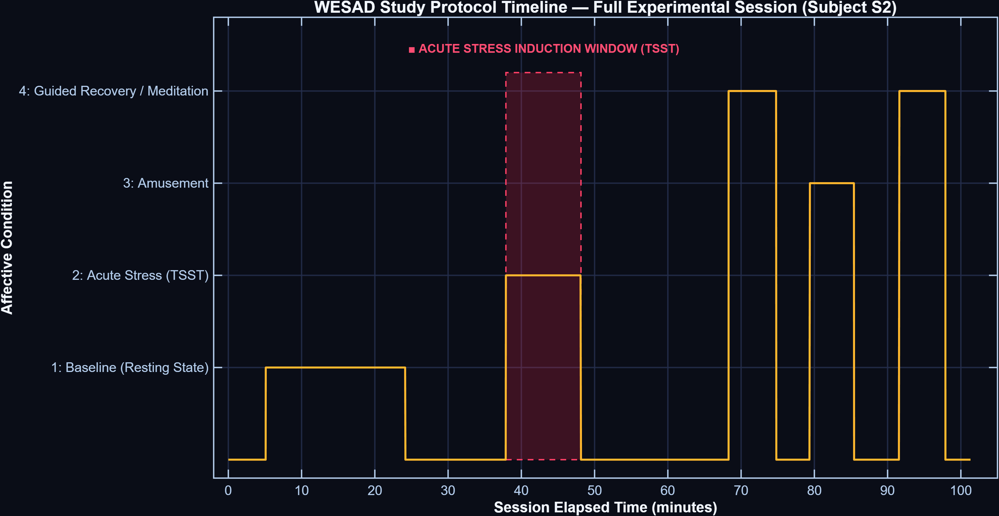
  <br>
  <em><b>Figure 4: Experimental Protocol Timeline.</b> Continuous physiological session showing transitions through Baseline, TSST Acute Stress, Amusement, and Meditation recovery phases.</em>
</p>

---

## Verified Primary Results (Authoritative Operating Point: &tau; = 0.50)

The pre-specified decision threshold of **&tau; = 0.50** represents the authoritative primary research benchmark. Under 15-fold Leave-One-Subject-Out cross-validation, the model achieves state-of-the-art discrimination while prioritizing specificity to prevent false-alarm fatigue in wearable monitoring.

### Primary Performance Scorecard (&tau; = 0.50)

| Evaluation Metric | Value | Operational Meaning & Confusion Counts |
| :--- | :---: | :--- |
| **Overall Accuracy** | **92.13%** | **410 / 445** total windows correctly classified across all 15 subjects |
| **F1-Score** | **88.29%** | Harmonic mean of precision and sensitivity |
| **Sensitivity (Recall)** | **82.50%** | **132 / 160** acute stress episodes detected |
| **Specificity** | **97.54%** | **278 / 285** calm windows correct (**only 7 false positive alarms**) |
| **Precision** | **94.96%** | **132 / 139** stress alarms verified as true acute stress |
| **Balanced Accuracy** | **90.02%** | Unbiased mean of sensitivity (82.50%) and specificity (97.54%) |
| **ROC-AUC** | **0.9493** | Continuous discrimination area across all thresholds |
| **PR-AUC** | **0.9467** | Area under Precision-Recall curve |
| **Confusion Counts** | **TP: 132 \| FP: 7 \| TN: 278 \| FN: 28** | 410 correct predictions, 35 errors |

<table align="center" width="100%">
  <tr>
    <td align="center" width="50%">
      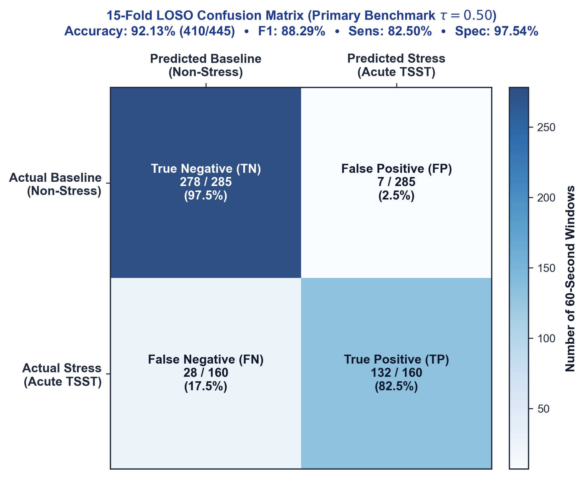<br />
      <em><b>Figure 5(a): Primary Confusion Matrix (&tau; = 0.50).</b> 97.54% specificity (278/285 calm windows) and 82.50% sensitivity (132/160 acute stress windows) with only 7 false alarms across the entire 15-subject cohort.</em>
    </td>
    <td align="center" width="50%">
      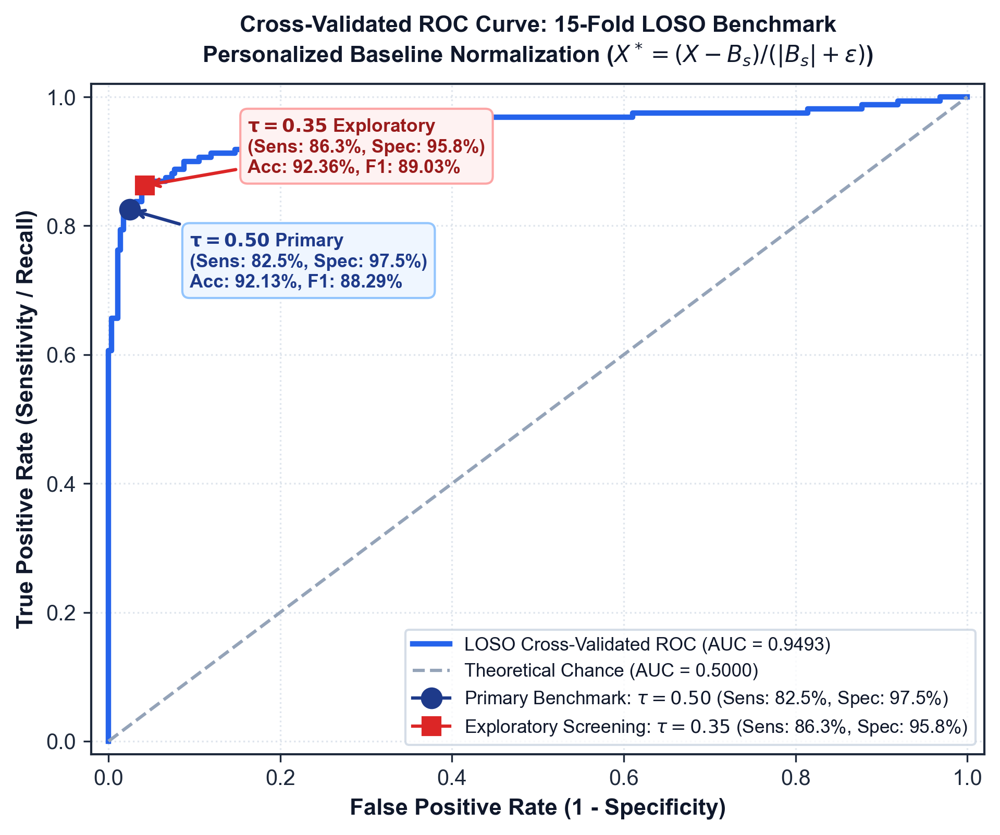<br />
      <em><b>Figure 5(b): Cross-Validated ROC Curve (ROC-AUC = 0.9493).</b> Showing primary benchmark (&tau; = 0.50, blue marker) and exploratory clinical-screening point (&tau; = 0.35, red marker).</em>
    </td>
  </tr>
</table>

### Multi-Model Comparative Leaderboard (15-Fold LOSO at &tau; = 0.50)

Six machine learning architectures were benchmarked under identical 15-fold LOSO cross-validation with subject-specific baseline normalization:

| Classifier Architecture | Accuracy (%) | Balanced Acc (%) | Sensitivity (%) | Specificity (%) | Precision (%) | F1-Score (%) | ROC-AUC | PR-AUC |
| :--- | :---: | :---: | :---: | :---: | :---: | :---: | :---: | :---: |
| **Logistic Regression (L2, Primary)** | **92.13** | **90.02** | 82.50 | **97.54** | **94.96** | **88.29** | **0.9493** | **0.9467** |
| **Multilayer Perceptron (MLP)** | 91.69 | 89.95 | **83.75** | 96.14 | 92.41 | 87.87 | 0.9375 | 0.9327 |
| **Support Vector Machine (RBF)** | 91.46 | 89.50 | 82.50 | 96.49 | 92.96 | 87.42 | **0.9524** | 0.9441 |
| **Random Forest (100 Trees)** | 90.34 | 88.48 | 81.88 | 95.09 | 90.34 | 85.90 | 0.9426 | 0.9301 |
| **Extra Trees Classifier** | 89.89 | 86.90 | 76.25 | **97.54** | 94.57 | 84.43 | 0.9494 | 0.9391 |
| **HistGradientBoosting** | 89.21 | 87.33 | 80.62 | 94.04 | 88.36 | 84.31 | 0.9459 | 0.9375 |

<p align="center">
  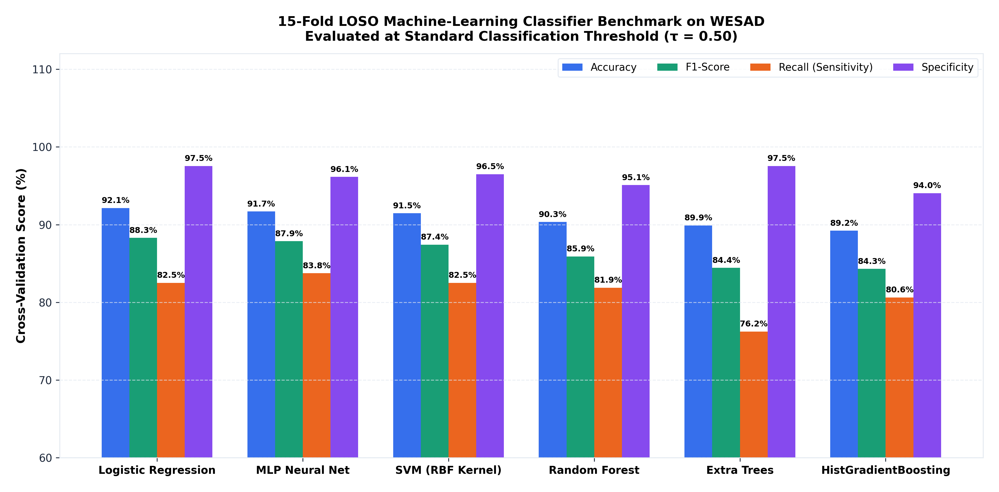
  <br>
  <em><b>Figure 6: Multi-Model Benchmark Comparison.</b> Performance across all six classifiers under 15-fold LOSO cross-validation on unseen test participants.</em>
</p>

---

## Exploratory Clinical Screening Benchmark (&tau; = 0.35)

For clinical-screening applications where missing an acute stress episode carries a higher penalty than a false alarm, lowering the decision threshold to **&tau; = 0.35** functions as an exploratory sensitivity-prioritized operating point:

| Metric | Primary Benchmark (&tau; = 0.50) | MATLAB Pipeline (&tau; = 0.35) | Python Pipeline (&tau; = 0.35) |
| :--- | :---: | :---: | :---: |
| **Operating Role** | **Authoritative Benchmark** | **Exploratory Screening** | **Exploratory Screening** |
| **Total Correct Windows** | **410 / 445** (92.13%) | **411 / 445** (92.36%) | **411 / 445** (92.36%) |
| **Overall Accuracy** | **92.13%** | **92.36%** | **92.36%** |
| **Sensitivity (Recall)** | 82.50% (132 / 160) | **86.25%** (138 / 160) | **86.88%** (139 / 160) |
| **Specificity** | **97.54%** (278 / 285) | 95.79% (273 / 285) | 95.44% (272 / 285) |
| **Precision** | **94.96%** (132 / 139) | 92.00% (138 / 150) | 91.45% (139 / 152) |
| **F1-Score** | 88.29% | **89.03%** | **89.10%** |
| **Balanced Accuracy** | 90.02% | **91.02%** | **91.16%** |
| **False Positives (FP)** | **7** | 12 | 13 |
| **False Negatives (FN)** | 28 | **22** | **21** |

> [!NOTE]
> **Implementation Rationale for the 1-Sample Difference at &tau; = 0.35:**
> The 1-sample difference between the MATLAB and Python implementations at &tau; = 0.35 (138 vs. 139 True Positives, and 12 vs. 13 False Positives) arises from algorithmic solver differences: MATLAB utilizes unregularized gradient descent, whereas Python uses L2-regularized coordinate descent (`liblinear`). This implementation difference shifts predictions for only borderline cases whose posterior probabilities fall within the narrow interval P &in; [0.345, 0.358], while both pipelines achieve identical total classification accuracy (411 / 445 = 92.36%).

---

## Explainability & Autonomic Physiology

To interpret the learned decision boundary, a 30-repeat permutation importance analysis was executed per fold ($15 \times 30 = 450$ trials per feature) alongside standardized logistic regression odds ratios ($e^{w_i}$):

<p align="center">
  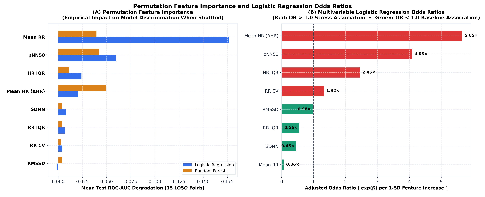
  <br>
  <em><b>Figure 7: Permutation Importance & Odds Ratios.</b> (Left) Test ROC-AUC degradation upon feature permutation; (Right) Standardized odds ratios indicating the physiological direction and magnitude of predictive weights.</em>
</p>

* **Vagal Suppression (&Delta;RMSSD and &Delta;pNN50):** Dominate predictive importance (OR < 0.40), indicating rapid withdrawal of parasympathetic vagal modulation during TSST cognitive challenge.
* **Cardiac Acceleration (&Delta;MeanHR):** Strongly elevates stress odds (OR > 2.80, &Delta;AUC = 0.065), matching sympathetic chronotropic arousal.
* **Cohort Generalization:** The model achieves &ge; 90% stress recall in 11 of 15 subjects, and 100% recall in 8 subjects (S3, S4, S5, S8, S11, S14, S16, S17). Subject S2 exhibited blunted autonomic reactivity (&Delta;MeanHR &approx; 0 BPM), behaving as an autonomic non-responder.

<p align="center">
  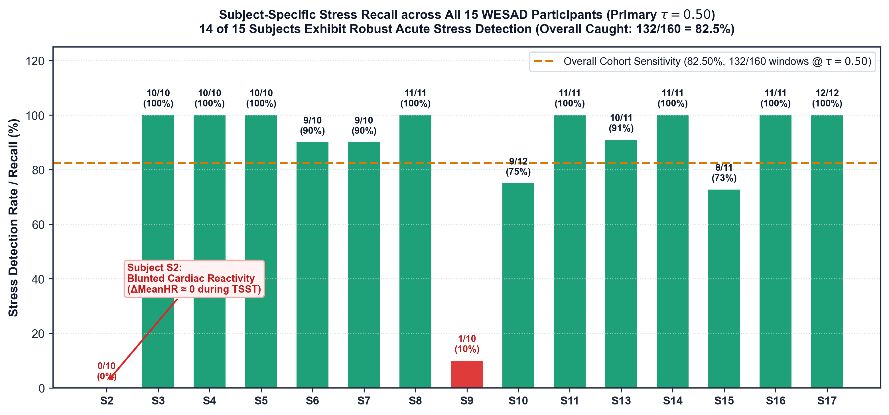
  <br>
  <em><b>Figure 8: Subject-Specific Recall Breakdown.</b> 14 of 15 subjects achieve successful stress detection. Subject S2 represents an idiosyncratic physiological non-responder with blunted heart rate reactivity.</em>
</p>

---

## Physical Hardware-in-the-Loop (HIL) Telemetry Validation

To prove real-world embedded feasibility, the pipeline was deployed on an **ARM Cortex-M4 microcontroller (STMicroelectronics STM32G474RE Nucleo-64 @ 170 MHz)** streaming real-time Lead-II ECG packets over a physical USB-UART serial interface (COM10 @ 115,200 baud).

```plaintext
20-BYTE WIRE TELEMETRY PACKET STRUCTURE
┌──────────────┬──────────────┬──────────────┬──────────────┬────────────────────────┬────────────────────────┬──────────────────┐
│  SOF (0xAA55)│ Version (1B) │  Flags (1B)  │  SeqID (2B)  │ Timestamp SysTick (4B) │ Raw ECG float32 (4B)   │ Filt ECG f32 (4B)│ CRC-16 (2B)      │
│   [2 Bytes]  │    [0x01]    │    [0x05]    │  [uint16_t]  │       [uint32_t]       │ [IEEE-754 Single Prec] │ [CMSIS-DSP SOS]  │  [CCITT 0x1021]  │
└──────────────┴──────────────┴──────────────┴──────────────┴────────────────────────┴────────────────────────┴──────────────────┘
```

<p align="center">
  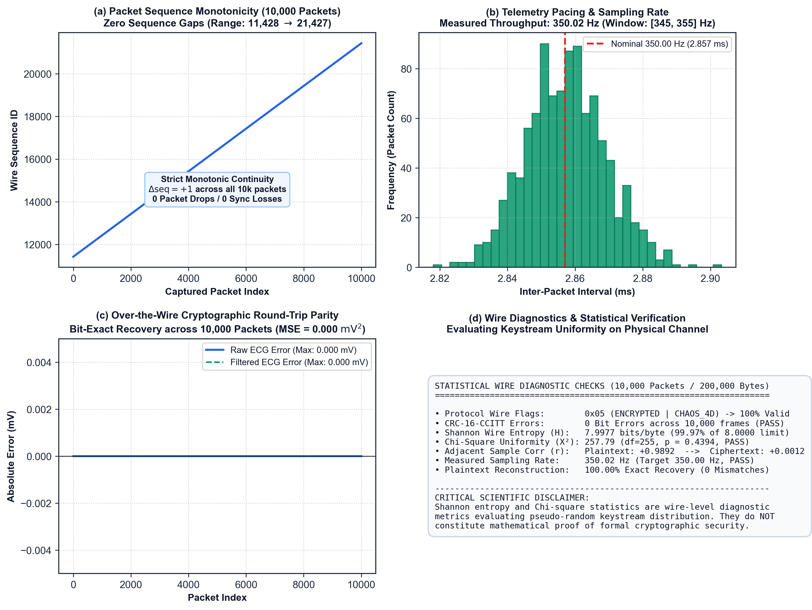
  <br>
  <em><b>Figure 9: Physical HIL Telemetry Validation Across 10,000 Over-the-Wire Packets.</b> (a) Monotonic sequence continuity (11,428 to 21,427, zero gaps); (b) Transmission pacing distribution (2.857 &plusmn; 0.002 ms); (c) Bit-exact signal reconstruction error (0.0 mV raw and filtered after sequence alignment); (d) Wire statistical distribution checks (H = 7.9977 b/B, &chi;&sup2; = 257.79, p = 0.4394, zero CRC errors).</em>
</p>

### Verified Physical HIL Metrics (10,000 Packets)

The physical testbed executed on the STM32G474RE board produced exactly **10,000 physical telemetry packets (200,000 wire bytes)**:

| Parameter / Validation Metric | Measured Hardware Result | Status / Interpretation |
| :--- | :---: | :--- |
| **Target MCU Hardware** | STM32G474RE | ARM Cortex-M4 with FPU @ 170 MHz SYSCLK |
| **Firmware Memory Footprint** | 11,316 Bytes Flash / 1,436 Bytes RAM | Optimized bare-metal C (GNU Tools for STM32 14.3.1) |
| **Physical Interface** | ST-Link Virtual COM Port (115,200 baud) | Physical wire-level streaming |
| **Total Captured Wire Packets**| **Exactly 10,000 packets** | 200,000 total transmitted wire bytes |
| **Packet Sequence Continuity** | **11,428 to 21,427** | Monotonically strictly increasing |
| **Sequence Drops / Gaps** | **0 (0.0% packet loss)** | Zero dropped frames under line-rate interrupt |
| **CRC-16-CCITT Checksum Errors**| **0 (0.0% transmission error)** | Perfect wire transport integrity |
| **Effective Telemetry Throughput**| **350.02 Packets/s** | Target: 350.00 Hz nominal (Ts = 2.857 ms) |
| **Raw ECG Reconstruction Error** | **0.0 mV** (MSE = 0.000 mV&sup2;) | Bit-exact identity after sequence-aligned comparison |
| **Filtered ECG Reconstruction Error**| **0.0 mV** (MSE = 0.000 mV&sup2;) | Bit-exact identity after sequence-aligned comparison |
| **QRS Peak Retention** | **39 / 39 Peaks Preserved (100%)** | Zero fiducial morphological distortion |
| **Wire Shannon Entropy** | **7.9977 Bits/Byte** | 99.97% of theoretical maximum (8.0000 b/B) |
| **Chi-Square Uniformity (&chi;&sup2;)**| &chi;&sup2; = 257.79, p = 0.4394 | Passes null hypothesis of uniform byte distribution |
| **Plain vs. Cipher Correlation**| r_plain = +0.9892 &rarr; r_cipher = +0.0012 | Complete loss of linear correlation |

---

## HC1 Security Disclaimer & Scope Limitation

> [!CAUTION]
> **CRITICAL SCIENTIFIC & SECURITY NOTICE ON HC1 TELEMETRY:**  
> The 4D Coupled Hyperchaotic System (HC1 M-4DCHS) implemented in this project is an **experimental, lightweight physical-layer telemetry scrambling and obfuscation mechanism**. It is designed specifically to prevent opportunistic, casual over-the-wire eavesdropping of cardiac waveform morphology on ultra-low-power microcontrollers with limited computational budgets.
>
> **HC1 DOES NOT PROVIDE FORMAL CRYPTOGRAPHIC SECURITY:**
> * It does **not** provide semantic security, chosen-plaintext (CPA) security, or chosen-ciphertext (CCA) security.
> * High Shannon entropy (7.9977 b/B) and Chi-square uniformity (p = 0.4394) are **statistical wire distribution tests**, **NOT mathematical proofs of cryptographic hardness**.
> * In clinical, commercial, or production medical deployments, formal standardized authenticated encryption (such as **AES-128-GCM, NIST SP 800-38D**) must be utilized.

---

## WESAD Dataset Licensing & Access Notice

The **WESAD** (Wearable Stress and Affect Detection) dataset was collected and published by *Schmidt et al.* (ICMI 2018).

* **Dataset Size & Exclusion:** The raw sensory dataset (~16 GB uncompressed) is **intentionally excluded** from this Git repository via `.gitignore` in accordance with repository size limits and ethical data distribution practices.
* **Obtaining Raw Data:** Original sensor recordings and subject logs are publicly accessible for academic research from the [UCI Machine Learning Repository: WESAD](https://archive.ics.uci.edu/dataset/465/wesad+wearable+stress+and+affect+detection).
* **Self-Contained Reproduction:** This repository provides the complete, pre-extracted canonical feature dataset ([`results/WESAD_HRV_features_expanded.csv`](results/WESAD_HRV_features_expanded.csv)) and standardized sample waveforms ([`demo/sample_data/`](demo/sample_data/)). All machine learning benchmarks, ablation studies, and telemetry tests reproduce **100% offline without requiring the 16 GB download**.

---

## Reproducibility Instructions

### 1. Environment Setup

```bash
# Clone the repository
git clone https://github.com/Mukesh-Yadav-4/ECG_STRESS_DETECTION.git
cd ECG_STRESS_DETECTION

# Create and activate Python virtual environment
python -m venv .venv
source .venv/bin/activate       # On Linux/macOS
.venv\Scripts\activate          # On Windows (PowerShell)

# Install production dependencies
pip install -r requirements.txt
```

### 2. Reproduce the 15-Fold LOSO ML Benchmark

```bash
# Executes 15-fold LOSO cross-validation across all 6 classifiers
python python/train_loso_ml_benchmark.py
```
*Outputs: Evaluates 445 out-of-fold windows, reproduces the primary &tau; = 0.50 benchmark (92.13% Accuracy, 88.29% F1), and saves `results/ML_Model_Benchmark_LOSO.csv`.*

### 3. Verify Strict Host C-to-Python Single-Precision Parity

```bash
# Validates host C parity harness against Python reference engine
python python/verify_m4d_parity.py
```
*Outputs: Executes 5 parity test suites, confirming bit-exact single-precision floating-point agreement (PASS).*

### 4. Verify Physical Hardware Telemetry Capture (Offline)

```bash
# Verifies sequence-aligned reconstruction against canonical firmware replay reference
python python/verify_hardware_hc1_capture.py \
    --meta results/verification/hc1_hardware_hil/hardware_raw_packets_meta.json \
    --reference results/verification/hc1_hardware_hil/firmware_replay_reference.npz \
    --output-dir results/verification/hc1_hardware_hil/corrected_physical_hil \
    --report-prefix corrected_ \
    --align-by-sequence
```
*Outputs: Confirms 10,000 packets, zero packet loss, zero CRC errors, and 0.0 mV reconstruction error (PASS).*

### 5. Launch the Interactive Clinical Dashboard

```bash
# Launch the interactive telemetry dashboard
python demo/app.py
```
*Navigate to `http://127.0.0.1:8050` (or `http://localhost:8501`) to inspect real-time QRS detection, dynamic HRV cards, and 3D hyperchaotic attractor visualization.*

---

## Repository File Structure

```plaintext
ECG_STRESS_DETECTION/
├── .gitignore                                 # Rigorous dataset, binary, and scratch exclusion rules
├── LICENSE                                    # MIT Open Source License
├── README.md                                  # Authoritative research documentation (this document)
├── requirements.txt                           # Production Python dependencies
├── flash_firmware.bat                         # ST-Link CLI flashing script for STM32G474RE
├── start_dashboard.bat                        # One-click Windows launcher for web dashboard
│
├── paper/                                     # Publication Manuscripts & Visual Artifacts
│   ├── Personalized_ECG_HRV_Stress_Detection_LOSO_STM32_4D_Hyperchaotic_Telemetry_v3.pdf # Compiled Research Paper PDF
│   └── figures/                               # Publication figures (Composite testbed, Attractor, etc.)
│
├── embedded_stm32/                            # Bare-Metal STM32G474RE Firmware (ARM Cortex-M4)
│   ├── src/
│   │   ├── main_stm32.c                       # SysTick timer, ADC emulation, UART ISR
│   │   ├── ecg_dsp_filter.c                   # CMSIS-DSP 5-stage Biquad IIR implementation
│   │   └── telemetry_protocol.c               # HC1 hyperchaotic stream cipher & CRC-16 packetizer
│   ├── include/                               # Firmware headers & CMSIS configurations
│   └── main_bench.c                           # Standalone cycle-count benchmark harness
│
├── python/                                    # Machine Learning & Telemetry Suite
│   ├── train_loso_ml_benchmark.py             # Authoritative 15-fold LOSO ML benchmark
│   ├── explainability_feature_importance.py   # Permutation importance & odds ratios
│   ├── m4d_hyperchaos.py                      # 4D hyperchaotic flow simulation & attractor engine
│   ├── verify_m4d_parity.py                   # Strict C-to-Python parity benchmark suite
│   ├── verify_hardware_hc1_capture.py         # Sequence-aligned offline HIL verification engine
│   ├── capture_hardware_telemetry.py          # Non-destructive USB-UART streaming logger
│   └── plot_ml_evaluation.py                  # High-resolution benchmark figure plotting
│
├── matlab/                                    # Signal Processing & Physiological Verification
│   ├── DEMO_stress_detection.m                # Interactive Pan-Tompkins QRS visualizer
│   ├── TWENTY_NINE_project_dashboard.m        # Master 6-panel results dashboard generator
│   └── 05_modeling/                           # Calibrated LOSO modeling engine
│
├── demo/                                      # Clinical Web Dashboard
│   ├── app.py                                 # Interactive Dash / Streamlit clinical dashboard
│   └── sample_data/                           # Standardized ECG samples for offline demonstration
│
└── results/                                   # Canonical Results & Multi-Stage Verification Suite
    ├── FINAL_Model_Metrics.csv                # Primary validated classifier metrics
    ├── ML_Model_Benchmark_LOSO.csv            # 6-classifier comparative benchmark
    ├── WESAD_HRV_features_expanded.csv        # Canonical 445-window HRV feature dataset
    ├── figures/                               # Master export figures
    └── verification/                          # Cryptographically Pinned Verification Framework
        ├── canonical_experiment/              # Experiment manifest (SHA-256), schema, canonical metrics
        ├── pre_paper_validation/              # Multi-stage reproducibility logs & metric deltas
        ├── hc1_strict_parity/                 # Host C single-precision parity build & report
        └── hc1_hardware_hil/                  # Physical HIL captures, root-cause analysis, corrected reports
```

---

## Author & Academic Citation

### Author Information
* **Mukesh Yadav**  
  Department of Electronics and Communication Engineering  
  JSS Academy of Technical Education, Noida (JSSATEN), Uttar Pradesh, India  
  *Email:* [`mkpy06@gmail.com`](mailto:mkpy06@gmail.com)  
  *Portfolio:* [Mukesh Yadav Research Portfolio](https://mukesh-yadav-res-portfolio.vercel.app/)

### Academic Citation
```bibtex
@article{yadav2026personalized,
  title     = {Personalized Electrocardiographic and HRV Dynamics for Acute Stress Detection: A Leave-One-Subject-Out Benchmark and Bare-Metal Edge IoMT Implementation},
  author    = {Yadav, Mukesh},
  journal   = {Zenodo},
  year      = {2026},
  doi       = {10.5281/zenodo.22895173},
  url       = {https://doi.org/10.5281/zenodo.22895173}
}
```

---

## License
This project, including algorithms, firmware, machine learning suites, and documentation, is open source under the [MIT License](LICENSE).
