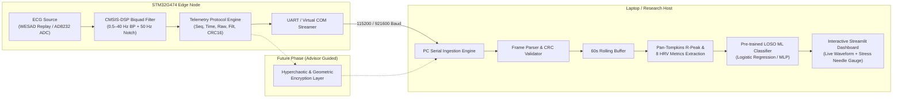

# Project Roadmap: WESAD ECG Telemetry & Stress Detection System

> **Target Platform:** STM32G474 (ARM Cortex-M4 @ 170 MHz) + PC/Cloud Telemetry Receiver  
> **Scientific Focus:** Autonomic Nervous System (ANS) Stress Detection using Lead-II ECG & HRV  
> **Engineering Focus:** Real-Time Embedded DSP, Robust Binary Telemetry, and Secure IoMT Edge Node  
> **Target Standard:** IEEE Journal / Conference Publication Quality (IEEE TBME / JBHI / Sensors)

---

## 1. System Architecture Overview



---

## 2. Milestone Status Dashboard

| Phase | Milestone | Scope / Deliverable | Status |
| :---: | :--- | :--- | :---: |
| **1** | **Dataset & DSP Pipeline** | WESAD extraction, MATLAB 0.5–40 Hz filter, Pan-Tompkins peak detection | <kbd>COMPLETED</kbd> |
| **2** | **ML Benchmark (LOSO)** | 15-Fold cross-validation across 6 models, zero-leakage baseline normalization | <kbd>COMPLETED</kbd> |
| **3** | **STM32 C DSP Core** | 5-stage Biquad IIR C code, 20-byte telemetry framing, test vectors | <kbd>COMPLETED</kbd> |
| **4** | **PC Telemetry Receiver** | Non-blocking serial listener, CRC-16 validator, buffer management | <kbd>COMPLETED</kbd> |
| **5** | **Live Streamlit Integration** | Real-time rolling strip-chart, live HRV gauges, live stress prediction | <kbd>COMPLETED</kbd> |
| **6** | **Physical Hardware Setup** | STM32CubeIDE project config, UART DMA, AD8232 analog front-end | <kbd>NEXT STEP</kbd> |
| **7** | **IoMT Encryption Layer** | Hyperchaotic map / geometric transformation payload encryption | <kbd>PLANNED (PHASE 2)</kbd> |

---

## 3. Detailed Phase Breakdown

### Phase 1: Data Acquisition & Clinical Signal Processing <kbd>COMPLETED</kbd>
- [x] Extracted raw 700 Hz Lead-II ECG and condition labels from raw WESAD files (`extract_ecg_labels.py`).
- [x] Implemented baseline wander elimination and high-frequency noise removal using a 4th-order Butterworth bandpass filter (0.5–40 Hz) and 50 Hz notch filter.
- [x] Designed 60-second sliding windows (50% overlap) with Pan-Tompkins R-peak detection and Median Absolute Deviation (MAD) adaptive thresholding.
- [x] Extracted **8 Core Autonomic HRV Metrics**:
  - `MeanHR` (Mean heart rate in BPM)
  - `RMSSD` (Root mean square of successive RR differences — primary vagal marker)
  - `SDNN` (Standard deviation of NN intervals — total autonomic variability)
  - `pNN50` (Percentage of interval differences $> 50\text{ ms}$)
  - `MeanRR` (Mean interval duration)
  - `RR_CV` (Coefficient of variation: $\text{SDNN} / \text{MeanRR}$)
  - `RR_IQR` & `HR_IQR` (Interquartile ranges for robust dispersion)

---

### Phase 2: Multi-Model Machine Learning Benchmark <kbd>COMPLETED</kbd>
- [x] Implemented zero-leakage **Subject-Specific Baseline Normalization**:
  $$\Delta x = \frac{x - \mu_{\text{baseline}}}{\max(|\mu_{\text{baseline}}|, \epsilon)}$$
- [x] Rigorously evaluated **6 Machine Learning Classifiers** across 15 subjects using 15-fold Leave-One-Subject-Out (LOSO) cross-validation:
  - **Logistic Regression**: **92.13% Accuracy**, **88.29% F1-Score**, **97.54% Specificity** (Top overall)
  - **MLP Neural Net (32 $\rightarrow$ 16)**: **91.69% Accuracy**, **87.87% F1-Score**
  - **SVM (RBF Kernel)**: **91.46% Accuracy**, **0.9524 ROC-AUC** (Highest AUC)
  - **Random Forest**: **90.34% Accuracy**, **85.90% F1-Score**
  - **Extra Trees**: **89.89% Accuracy**, **84.43% F1-Score**
  - **HistGradientBoosting**: **89.21% Accuracy**, **84.31% F1-Score**

---

### Phase 3: STM32 C Firmware Core <kbd>COMPLETED</kbd>
- [x] Designed 5-stage Biquad IIR filter (4 stages bandpass + 1 stage notch) compatible with ARM CMSIS-DSP `arm_biquad_cascade_df1_f32`.
- [x] Embedded dual coefficient profiles: 700 Hz (raw WESAD acquisition) and 350 Hz (telemetry stream).
- [x] Designed 20-byte binary telemetry frame with CRC-16-CCITT checksum:
  ```
  [0..1]   0xAA 0x55       : Sync header
  [2]      0x01            : Protocol version
  [3]      Flags           : Bit 0 = Encrypted, Bit 1 = Live Sensor
  [4..5]   Sequence ID     : uint16_t packet counter (loss detection)
  [6..9]   Timestamp       : uint32_t millisecond hardware timestamp
  [10..13] Raw Sample      : float32_t (raw ECG)
  [14..17] Filtered Sample : float32_t (real-time filtered ECG)
  [18..19] CRC-16          : uint16_t checksum over bytes [2..17]
  ```
- [x] Verified C benchmark harness (`main_bench.c`) with 100% CRC validity and zero packet corruption.

---

### Phase 4: PC Telemetry Receiver & Stream Ingestion <kbd>COMPLETED</kbd>
- [x] Build non-blocking Python serial receiver (`stm32_telemetry_receiver.py`):
  - Auto-synchronization on `0xAA 0x55` frame boundaries.
  - Background circular buffer to eliminate packet loss during GUI rendering.
  - Frame integrity checking with CRC-16-CCITT and sequence gap tracking.
- [x] Build software stream simulator (`simulate_stm32_stream.py`):
  - Streams pre-compiled WESAD test vectors at exact 350 Hz / 700 Hz timing over a virtual port or loopback so the whole system can run and be debugged without the physical STM32 plugged in.
- [x] Integrate real-time 60-second sliding buffer for continuous HRV feature extraction and personalized baseline ($\Delta x$) stress scoring.

---

### Phase 5: Streamlit Live Telemetry Dashboard <kbd>COMPLETED</kbd>
- [x] Added **"⚡ 1. STM32G474 IoMT Hardware Telemetry"** tab to `demo/app.py`:
  - Dual Mode Support: Simulated STM32 Link (Virtual) + Physical USB COM Port.
  - Protocol integrity cards (Packets ingested, CRC-16 validity, zero drops, frame sync).
  - Real-time Plotly strip-chart displaying raw ECG alongside STM32 on-chip Biquad filtered ECG.
  - Live autonomic telemetry meters (HR, RMSSD, SDNN, pNN50, MeanRR, detected QRS peaks).
  - Calibrated half-donut stress dial ($\tau = 0.35$) with acute stress alert badges.

---

### Phase 6: Physical STM32 Deployment & AD8232 Sensor <kbd>PLANNED</kbd>
- [ ] Create STM32CubeIDE project for STM32G474:
  - Configure TIM2/TIM3 to trigger ADC1 at 700 Hz via DMA.
  - Configure USART2 / Virtual COM Port (VCP) at 115200 / 921600 baud with DMA.
  - Drop in `ecg_dsp_filter.c` and `telemetry_protocol.c`.
- [ ] Connect AD8232 analog front-end:
  - `OUTPUT` $\rightarrow$ STM32 ADC pin (e.g., PA0).
  - `3.3V` & `GND` $\rightarrow$ STM32 power rails.
  - `LO+` / `LO-` (Leads-off detection) $\rightarrow$ GPIO inputs.

---

### Phase 7: Secure IoMT Hardware Encryption <kbd>FUTURE / ADVISOR DIRECTIVE</kbd>
- [ ] Activate encryption once foundational pipeline is fully verified.
- [ ] Implement hyperchaotic map and geometric transformation cipher on STM32.
- [ ] Set `TELEMETRY_FLAG_ENCRYPTED` in frame header.
- [ ] Implement Python counterpart decryption module prior to feature extraction.

---

## 4. Key Repository File Map

```
ECG_STRESS_DETECTION/
├── ROADMAP.md                           <-- Master project roadmap and architecture guide
├── EXECUTION_GUIDE.md                   <-- Complete step-by-step reproduction instructions
├── requirements.txt                     <-- Python environment dependencies
│
├── embedded_stm32/                      <-- STM32 C Firmware Core
│   ├── include/
│   │   ├── ecg_dsp_filter.h             <-- Biquad IIR filter definitions & coefficients
│   │   ├── telemetry_protocol.h         <-- 20-byte binary packet structure & CRC-16
│   │   └── wesad_test_samples.h         <-- Benchmark WESAD test vectors
│   ├── src/
│   │   ├── ecg_dsp_filter.c             <-- CMSIS-DSP Biquad difference equations
│   │   ├── telemetry_protocol.c         <-- Frame packing and CRC validation
│   │   └── wesad_test_samples.c         <-- Sample data definitions
│   └── main_bench.c                     <-- Standalone C benchmark harness
│
├── python/                              <-- Host Analytics & Verification
│   ├── extract_ecg_labels.py            <-- Raw WESAD pickle extractor
│   ├── train_loso_ml_benchmark.py       <-- 15-Fold LOSO 6-model training benchmark
│   ├── explainability_feature_importance.py <-- Permutation feature importance
│   ├── export_demo_samples.py           <-- Compact test sample exporter
│   ├── export_embedded_constants.py     <-- Filter coefficient generator
│   └── stm32_telemetry_receiver.py      <-- [Phase 4] PC serial ingestion engine
│
├── demo/                                <-- Interactive Research UI
│   ├── app.py                           <-- Streamlit stress detection dashboard
│   └── sample_data/                     <-- Pre-packaged 60s test waveforms
│
└── results/                             <-- Benchmark Data & Figures
    ├── ML_Model_Benchmark_LOSO.csv      <-- 15-fold cross-validation metrics
    └── figures/                         <-- Master evaluation charts
```
